# Getting Started

> [!IMPORTANT]
> If this is your first session, begin with [START_HERE.md](START_HERE.md). It contains the exact Codex prompt and every click from creating a GitHub account through generating Mission Control. Return here after the startup workflow succeeds.

```mermaid
flowchart LR
    ACCOUNT["Account<br/>identity + security"] --> WEB["Browser practice<br/>repo + branch + PR"]
    WEB --> FORK["Fork<br/>your GitHub copy"]
    FORK --> START["Enable Actions<br/>run Start Program"]
    START --> LAB["LAB-00<br/>first Next.js browser change"]
    LAB --> CLONE["Clone<br/>your computer"]
    CLONE --> TOOLS["Install tools<br/>Git · Node · Codex · CLIs"]

    classDef context fill:#dbeafe,stroke:#2563eb,color:#172554;
    classDef plan fill:#fef3c7,stroke:#d97706,color:#451a03;
    classDef build fill:#dcfce7,stroke:#16a34a,color:#052e16;
    class ACCOUNT,WEB context;
    class FORK,START plan;
    class LAB,CLONE,TOOLS build;
```



Move from left to right. Do not install the developer toolchain before you understand the account, repository, fork, and local-copy relationship.

## Start even if you have no accounts yet

You can read this public repository without signing in. Milestone 0 walks you through creating a GitHub account, verifying the email address, enabling two-factor authentication, understanding why the agency uses GitHub, and making your first fork. Do not skip those explanations merely because a mentor could click the buttons for you.

Use GitHub's official guides for [creating an account](https://docs.github.com/en/get-started/start-your-journey/creating-an-account-on-github) and [getting started with an account](https://docs.github.com/en/get-started/onboarding/getting-started-with-your-github-account). Record what each action accomplishes in your own words.

If a visual walkthrough helps, use the matching Git and GitHub entries in the [task-specific video learning path](resources/video-learning-path.md), then verify the behavior in GitHub's current documentation.

## What you will install

- A secured GitHub account, Git, and GitHub CLI (`gh`).
- Node.js 24 LTS and npm for Next.js projects.
- Codex as the only AI coding environment used in the core curriculum.
- Vercel CLI so Codex can link projects, deploy previews, inspect build failures, and read runtime logs from the repository context.
- Free accounts on Vercel and Supabase before their respective milestones.
- A password manager for credentials. Never keep real credentials in lesson notes.

Confirm your setup:

```bash
git --version
gh auth status
node --version
npm --version
```

## Why fork and clone?

The canonical `saliftankoano/pierre-build-program` repository is the curriculum source. A **fork** is your GitHub-owned copy: you can create branches, issues, PRs, and progress without changing the canonical course. A **clone** is the working copy downloaded to your computer so Codex and local tools can inspect and change files. A **push** sends your local commits back to your GitHub fork.

GitHub's [forking and cloning explanation](https://docs.github.com/en/desktop/adding-and-cloning-repositories/cloning-and-forking-repositories-from-github-desktop) is required milestone 0 reading.

## Create your agency workspace before installing local tools

Fork this repository rather than editing the canonical curriculum. Your fork keeps its own issues, pull requests, Actions, and progress while retaining an upstream relationship for curriculum updates.

1. Open your fork’s **Actions** tab and enable workflows after reviewing them.
2. Open **Start Pierre Build Program** and select **Run workflow**.
3. The workflow idempotently creates Mission Control, milestone 0 stories, and `LAB-00`.
4. Follow the lab link, edit the small Next.js handoff page, and move the change through a branch and pull request.
5. Create or update [the employer-neutral learner profile](learner-profile.yml). Never add employer names, internal systems, network details, credentials, or incident data.

The browser path is primary for milestone 0. After the first change window, install the local toolchain in milestone 1. The local equivalent remains available:

```bash
gh repo fork saliftankoano/pierre-build-program --clone
cd pierre-build-program
npm install
npm run validate
npm run agency:bootstrap -- --repo YOUR_HANDLE/pierre-build-program
npm run agency:bootstrap -- --repo YOUR_HANDLE/pierre-build-program --apply
```

The first bootstrap command is a dry run; read its output before using `--apply`. Invite your mentor as a collaborator on your fork. In repository **Settings → Actions → General → Workflow permissions**, allow GitHub Actions to create issues. Keep your application repositories separate from this curriculum fork. If a command is unfamiliar, use the [PAUSE protocol](playbooks/pause-protocol.md) before running it.

## Work one issue at a time

1. Assign the issue to yourself.
2. Move it to `in progress` with a comment.
3. Create a branch: `git switch -c story/SWAI-001-short-name`.
4. Give Codex the issue, relevant client documents, and current repository context.
5. Commit small, coherent changes using the story ID.
6. Push and open a PR using the supplied template.
7. Complete the evidence and comprehension sections.
8. Merge only after checks and required review pass.

Every milestone also releases one `lab` issue. Begin with a prediction, run the normal baseline, activate the synthetic incident, collect evidence, make a focused repair, and submit `evidence/labs/LAB-XX.md`. The generated Mission Control issue displays active, blocked, evidence-ready, accepted, and locked milestones.

Use `npm run agency:next -- --repo OWNER/REPO --milestone 0` to preview what the progressive release automation will open next.

Use the reusable prompts in [Codex as your learning partner](playbooks/codex-learning-partner.md). The repository expects Codex to handle routine explanations and evidence-based troubleshooting; mentor escalation is for formal review gates, external authority, and material product decisions.

## When you are stuck

Do not send an AI only “it does not work.” Supply a debugging packet:

- What you expected.
- What actually happened.
- Exact reproduction steps.
- The full error message.
- Relevant logs with secrets removed.
- Files or functions involved.
- What you already tried and what changed.

After 30 focused minutes, open the blocker issue form. Being blocked is normal; hiding uncertainty is expensive.

## Definition of ready for a story

Before coding, you can identify the user, outcome, acceptance criteria, dependencies, design references, security constraints, and non-goals. If a missing answer could materially change the solution, ask before implementation.

## Definition of done for a story

- Acceptance criteria demonstrated.
- Lint, type checking, tests, and build pass where applicable.
- Loading, empty, error, mobile, and keyboard behavior considered.
- No secrets or private data in code, logs, screenshots, or commits.
- PR explains the change, evidence, limitations, and rollback.
- You can explain the important code in plain language.
