# Pierre Build Program

**A visual, agency-style path from “I understand what a loop is” to shipping professional Next.js products with Codex.**

Pierre does not need to wait until he can write an application from memory. He begins with complete projects, learns each concept when the work requires it, and remains responsible for understanding, testing, securing, and communicating what Codex helps create.

> [!IMPORTANT]
> AI writes quickly; the product builder owns the result. Never paste real secrets, private client data, forensic evidence, or unapproved employer code into an AI tool. Never run a command you cannot explain well enough to predict what it will affect.

## The transformation

```mermaid
flowchart LR
    A["START<br/>Ideas + technical curiosity<br/>Loops make sense<br/>Apps do not yet"]
    B["FOUNDATION<br/>GitHub identity<br/>Codex cockpit<br/>Planning vocabulary"]
    C["BUILD<br/>Next.js interfaces<br/>APIs<br/>Supabase products"]
    D["PROTECT<br/>Auth + RLS<br/>Secrets<br/>Testing + recovery"]
    E["SHIP<br/>Client demos<br/>Vercel production<br/>Handoff + support"]
    F["GRADUATE<br/>Independent AI<br/>product builder"]

    A -->|"learn by doing"| B
    B -->|"approved plan"| C
    C -->|"working product"| D
    D -->|"release evidence"| E
    E -->|"mentor defense"| F

    classDef start fill:#dbeafe,stroke:#2563eb,color:#172554,stroke-width:2px;
    classDef plan fill:#fef3c7,stroke:#d97706,color:#451a03,stroke-width:2px;
    classDef build fill:#dcfce7,stroke:#16a34a,color:#052e16,stroke-width:2px;
    classDef protect fill:#fee2e2,stroke:#dc2626,color:#450a0a,stroke-width:2px;
    classDef ship fill:#ede9fe,stroke:#7c3aed,color:#2e1065,stroke-width:2px;
    class A start;
    class B plan;
    class C build;
    class D protect;
    class E,F ship;
```

**Color key:** blue = starting context · amber = planning · green = building · red = risk/security · purple = delivery and graduation.

## How to start—even without a GitHub account

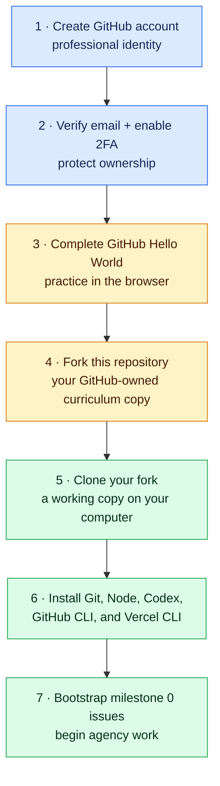

Start with [Getting Started](GETTING_STARTED.md). It explains why each object exists before asking Pierre to use it. The canonical repository is the course; a **fork** is Pierre’s GitHub-owned workbook; a **clone** is the copy on his computer; a **branch** isolates one assignment; a **pull request** is the review packet.

After completing the account and fork steps:

```bash
gh repo fork saliftankoano/pierre-build-program --clone
cd pierre-build-program
npm install
npm run validate
npm run agency:bootstrap -- --repo YOUR_HANDLE/pierre-build-program
npm run agency:bootstrap -- --repo YOUR_HANDLE/pierre-build-program --apply
```

The first bootstrap command is a safe preview. `--apply` creates the milestone 0 issues after Pierre reviews what will happen.

## The simulated agency

Pierre works as the developer/product builder at **Pierre Build Studio**. The fictional team supplies the information and pressure a real agency would provide.

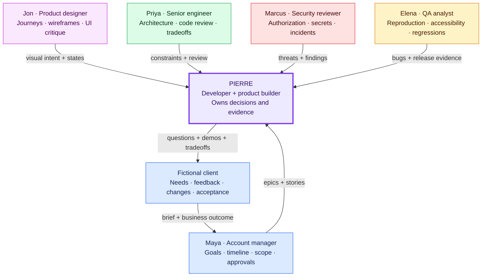

Later tickets intentionally contain ambiguity, missing assets, conflicting feedback, security findings, and scope changes. Pierre must ask useful questions, label assumptions, identify non-goals, and present tradeoffs instead of letting Codex guess.

## The 178-hour project path

```mermaid
flowchart LR
    subgraph FOUNDATION["FOUNDATION · 28 hours"]
      M0["M0 · 8h<br/>GitHub + agency"]
      M1["M1 · 8h<br/>Codex cockpit"]
      M2["M2 · 12h<br/>Planning + UI discovery<br/>NO PRODUCTION CODE"]
      M0 --> M1 --> M2
    end

    subgraph FIRSTCLIENT["FIRST CLIENT · 26 hours"]
      M3["M3 · 12h<br/>Next.js vertical slice"]
      M4["M4 · 14h<br/>Marketing launch<br/>MENTOR GATE"]
      M3 --> M4
    end

    subgraph PRODUCTS["PRODUCT SYSTEMS · 62 hours"]
      M5["M5 · 12h<br/>API research spike"]
      M6["M6 · 16h<br/>API data product"]
      M7["M7 · 16h<br/>Supabase foundation"]
      M8["M8 · 18h<br/>Authenticated product<br/>MENTOR GATE"]
      M5 --> M6 --> M7 --> M8
    end

    subgraph DELIVERY["DELIVERY + CAPSTONE · 62 hours"]
      M9["M9 · 16h<br/>Integrations + AI"]
      M10["M10 · 14h<br/>Production hardening<br/>MENTOR GATE"]
      M11["M11 · 32h<br/>Forensics capstone<br/>FINAL GATE"]
      M9 --> M10 --> M11
    end

    M2 -->|"approved plan"| M3
    M4 -->|"first client launch"| M5
    M8 -->|"secure product"| M9

    classDef foundation fill:#fef3c7,stroke:#d97706,color:#451a03;
    classDef build fill:#dcfce7,stroke:#16a34a,color:#052e16;
    classDef data fill:#dbeafe,stroke:#2563eb,color:#172554;
    classDef ship fill:#ede9fe,stroke:#7c3aed,color:#2e1065;
    class M0,M1,M2 foundation;
    class M3,M4 build;
    class M5,M6,M7,M8 data;
    class M9,M10,M11 ship;
```

| Milestone | What Pierre visibly delivers |
| --- | --- |
| [0 · GitHub and agency foundations](curriculum/00-agency-onboarding.md) | Secured account, fork/clone/branch/PR practice, recovery exercise, ranked idea inventory |
| [1 · Codex developer cockpit](curriculum/01-codex-developer-cockpit.md) | Codex instructions, tool inventory, GitHub/Vercel diagnostics, safe permissions |
| [2 · Agent planning and UI discovery](curriculum/02-agent-planning-and-ui-discovery.md) | Decision-complete plan, frontend glossary, three visual directions, component audit |
| [3 · First Next.js vertical slice](curriculum/03-first-vertical-slice.md) | Responsive client section deployed to a Vercel preview |
| [4 · Client marketing launch](curriculum/04-client-marketing-launch.md) | Complete ClearPath website, production launch, client handoff |
| [5 · API research spike](curriculum/05-api-research-spike.md) | Tested comparison of three providers and an architecture decision |
| [6 · Next.js API data product](curriculum/06-api-data-product.md) | Resilient deployed dashboard with loading/error/empty states |
| [7 · Next.js + Supabase foundation](curriculum/07-supabase-foundation.md) | Database workflow, migrations, synthetic seeds, CRUD, and RLS |
| [8 · Authenticated Next.js product](curriculum/08-authenticated-product.md) | Roles, ownership, protected storage, cross-user authorization tests |
| [9 · Integrations and AI](curriculum/09-integrations-and-ai.md) | Justified integration, bounded AI capability, retries and fallbacks |
| [10 · Production hardening](curriculum/10-production-hardening.md) | Tests, observability, incident drill, rollback, maintenance proposal |
| [11 · Forensics capstone](curriculum/11-forensics-capstone.md) | Northstar portal delivered from discovery through support handoff |

Mentor reviews occur after milestones 4, 8, 10, and 11. Codex handles daily teaching, story clarification, planning support, code explanation, research, and debugging practice.

## How one story moves through the agency

```mermaid
flowchart LR
    I["ISSUE<br/>persona + outcome<br/>acceptance + non-goals"]
    C["CLARIFY<br/>facts vs assumptions<br/>material questions"]
    P["PLAN WITH CODEX<br/>small steps + docs<br/>risks + tests"]
    B["BUILD ONE STORY<br/>focused diff<br/>no scope creep"]
    V["VERIFY<br/>checks + browser<br/>security + accessibility"]
    E["EXPLAIN<br/>trace + modification<br/>seeded bug"]
    PR["PULL REQUEST<br/>preview + evidence<br/>limitations"]
    R["REVIEW<br/>client · mentor · QA<br/>merge or revise"]

    I --> C --> P --> B --> V --> E --> PR --> R
    R -. "changes requested" .-> B

    classDef input fill:#dbeafe,stroke:#2563eb,color:#172554;
    classDef thinking fill:#fef3c7,stroke:#d97706,color:#451a03;
    classDef action fill:#dcfce7,stroke:#16a34a,color:#052e16;
    classDef proof fill:#ede9fe,stroke:#7c3aed,color:#2e1065;
    class I input;
    class C,P thinking;
    class B,V,E action;
    class PR,R proof;
```

Every released issue contains the user, business outcome, context, observable acceptance criteria, data/API contract, security/privacy/accessibility/analytics expectations, dependencies, explicit non-goals, Definition of Done, evidence, and just-in-time concepts. Bugs add reproduction and regression contracts; spikes add a question, timebox, alternatives, and decision record.

## Codex is the first and only required AI environment

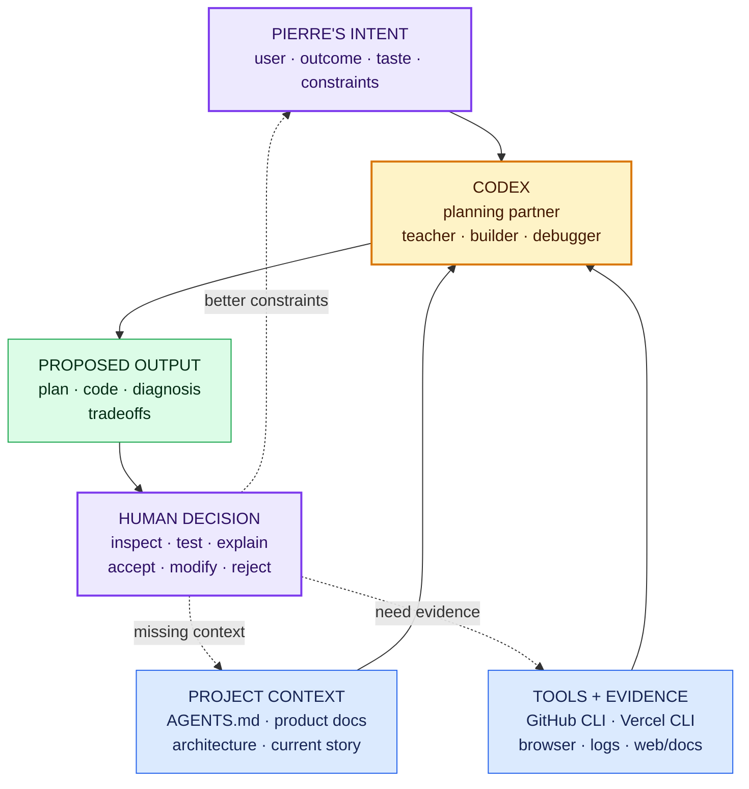

Claude, Cursor, Copilot, v0, and other environments are acknowledged, but the core path does not switch between them. Pierre first learns durable habits—context, constraints, permissions, primary-document research, testing, diff review, and explanation—in Codex. Those habits transfer later.

When Pierre does not understand something, he should not ask only “fix it.” He asks Codex to:

1. Explain the concept through the current Next.js story and exact files.
2. Label what runs in the browser, Next.js server, database, build, or external service.
3. Find the current primary documentation and match it to the installed version.
4. Ask Pierre to predict what will happen before running the code.
5. Let Pierre explain it back and identify the specific gap.
6. Create the smallest test or experiment that proves the behavior.

## Planning comes before production code

Milestone 2 is deliberately **planning only**.

```mermaid
flowchart LR
    IDEA["RAW IDEA<br/>what Pierre imagines"]
    INTERVIEW["CODEX INTERVIEW<br/>one material question<br/>at a time"]
    MAP["UNDERSTANDING MAP<br/>facts · preferences<br/>assumptions · unknowns"]
    RESEARCH["CURRENT RESEARCH<br/>primary docs · cost<br/>security · failure"]
    OPTIONS["OPTIONS<br/>build · library<br/>service · defer"]
    DESIGN["VISUAL DIRECTIONS<br/>3 distinct systems<br/>terms + references"]
    STORIES["AGENCY PLAN<br/>epics · stories<br/>acceptance · evidence"]
    APPROVAL["DECISION GATE<br/>approve · spike · reject"]

    IDEA --> INTERVIEW --> MAP --> RESEARCH --> OPTIONS --> DESIGN --> STORIES --> APPROVAL
    APPROVAL -. "unresolved material risk" .-> RESEARCH

    classDef intent fill:#ede9fe,stroke:#7c3aed,color:#2e1065;
    classDef discover fill:#dbeafe,stroke:#2563eb,color:#172554;
    classDef decide fill:#fef3c7,stroke:#d97706,color:#451a03;
    classDef ready fill:#dcfce7,stroke:#16a34a,color:#052e16;
    class IDEA intent;
    class INTERVIEW,MAP,RESEARCH discover;
    class OPTIONS,DESIGN decide;
    class STORIES,APPROVAL ready;
```

Codex may know useful tools Pierre has never encountered and can research unfamiliar ones through web search. Pierre saves time by treating the agent as an informed partner, but he verifies recommendations through primary documentation, safe experiments, actual cost/limits, license, privacy, maintenance, and failure behavior.

## Learn the visual language before directing the frontend

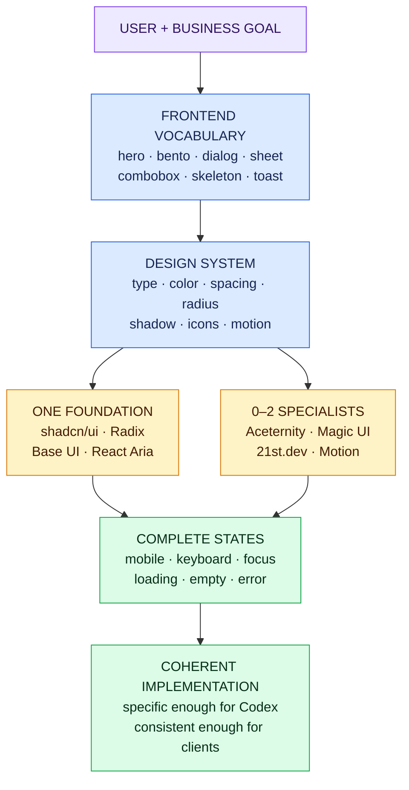

Use the [UI Library Field Guide](resources/ui-library-field-guide.md) to explore live components visually. Choose one accessible foundation, then at most two specialist components with obvious story value. Every adopted component receives a source, license, version, dependency, accessibility, responsive, reduced-motion, and maintenance review.

## Understand where Next.js code actually runs

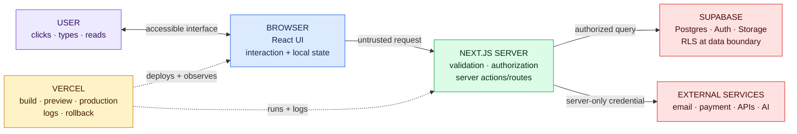

This boundary map appears repeatedly because it explains props, Client Components, API routes, validation, secrets, database policies, caching, logs, and deployment failures.

## Secrets: the boundary that cannot be guessed

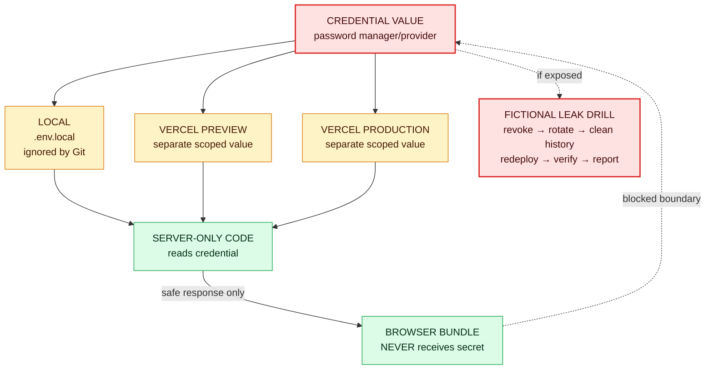

`.env.example` contains names and explanations only. A `NEXT_PUBLIC_` value is sent to the browser and therefore cannot be treated as secret. The leak drill uses fictional credentials but practices the real response: revocation, rotation, history/log review, redeployment, invalidation testing, and incident documentation.

## Progressive release and evidence gates

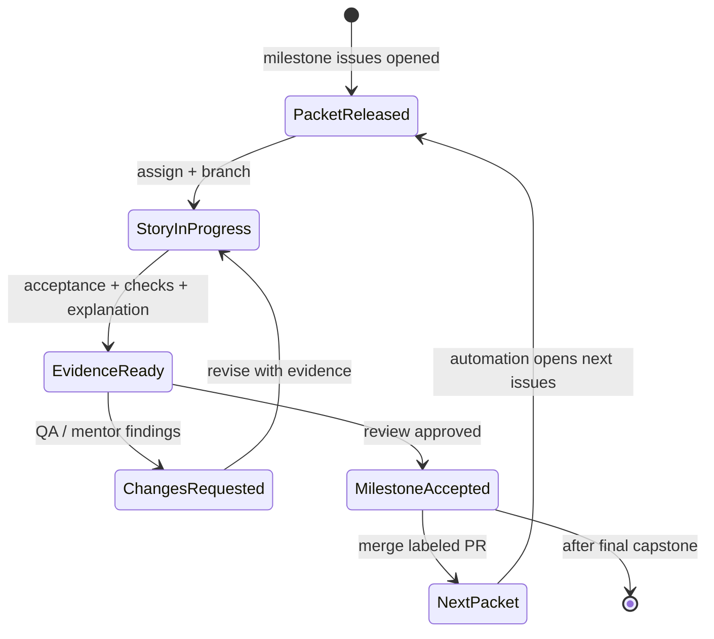

Every milestone PR includes linked stories, acceptance evidence, working deployment URL, screenshots or recordings, automated checks, security and accessibility review, code explanation, a controlled modification, seeded-bug diagnosis, limitations, and retrospective.

## Graduation

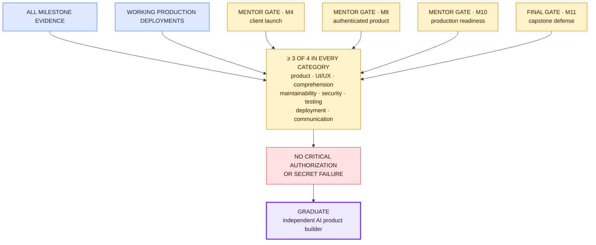

Pierre must independently plan for Codex, clarify requirements, explain and modify generated code, debug from evidence, evaluate unfamiliar tools, model Supabase data and RLS, protect and rotate credentials, handle feedback, and deploy, roll back, document, and hand off a client application.

## Repository map

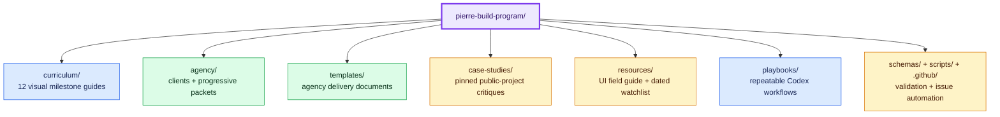

Application code belongs in separate repositories. After planning approval, create one with:

```bash
npm run project:new -- my-project-name
```

The generator creates a strict TypeScript Next.js App Router project with Tailwind, Supabase, `.env.example`, durable Codex context, CI, Vitest, Playwright, and the standard `npm run check`, `npm test`, `npm run test:e2e`, and `npm run build` commands.

## Educational and safety boundary

The Northstar project uses synthetic data and safe sample files. It is educational software—not court-grade chain-of-custody software, compliance-certified evidence storage, evidence-integrity certification, legal advice, or a production forensic system.

## License

Pierre Build Program is released under the [MIT License](LICENSE). Linked case-study repositories retain their own licenses; links and critique do not grant permission to copy unlicensed code.
