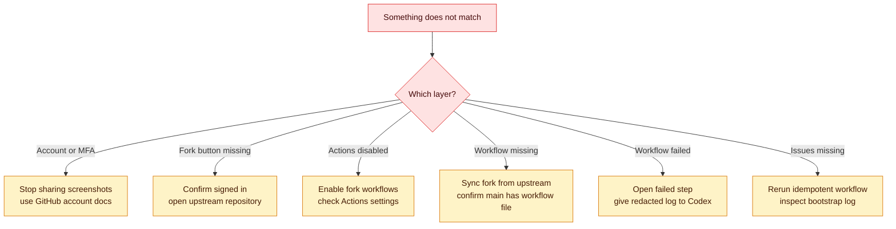

# Start here — Pierre's first guided session

This page assumes no GitHub account, no fork, and no installed developer tools. Keep it open until Mission Control exists in your own fork.

> [!IMPORTANT]
> Start a Codex task before doing the steps below. Codex is your day-to-day guide. You—not Codex—must create accounts, choose passwords, enable MFA, approve permissions, and store recovery codes.

```mermaid
flowchart LR
    C["1 · Open Codex<br/>give it this repository"] --> A["2 · Secure GitHub<br/>account + MFA"]
    A --> H["3 · Hello World<br/>practice GitHub objects"]
    H --> F["4 · Fork<br/>your curriculum copy"]
    F --> W["5 · Enable workflow<br/>review permissions"]
    W --> M["6 · Run Start Program<br/>create Mission Control"]
    M --> I["7 · Work first issue<br/>Codex guides each checkpoint"]

    classDef guide fill:#ede9fe,stroke:#7c3aed,color:#2e1065;
    classDef identity fill:#dbeafe,stroke:#2563eb,color:#172554;
    classDef work fill:#fef3c7,stroke:#d97706,color:#451a03;
    classDef ready fill:#dcfce7,stroke:#16a34a,color:#052e16;
    class C guide;
    class A,H identity;
    class F,W work;
    class M,I ready;
```



**Text route:** open Codex → secure a GitHub account → practice GitHub once → fork the curriculum → enable its reviewed workflow → create Mission Control → follow one issue at a time.

## Checkpoint 1 — make Codex your guide

Open Codex and start a task with this exact message:

```text
I am beginning Pierre Build Program from zero application-building experience.
The curriculum is https://github.com/saliftankoano/pierre-build-program.
Read START_HERE.md and AGENTS.md before guiding me.

Guide me through one checkpoint at a time. For every checkpoint:
1. explain why it exists in plain language;
2. tell me the exact page, button, field, or command;
3. tell me what success looks like;
4. wait for my result or a redacted screenshot;
5. diagnose any difference from evidence;
6. never ask for or expose passwords, MFA codes, recovery codes, tokens, cookies,
   employer information, client data, or real incident details.

Begin with Checkpoint 2 in START_HERE.md. Do not skip ahead.
```

Codex may explain screens and inspect redacted screenshots. It must not receive passwords, authentication codes, recovery codes, API keys, session cookies, or unredacted account-security pages.

## Checkpoint 2 — create and protect the GitHub account

1. Open [Join GitHub](https://github.com/signup).
2. Use a durable personal email address—not an employer address.
3. Choose a professional username you would be comfortable showing a client.
4. Create a unique password in a password manager.
5. Complete GitHub's verification and verify the email message GitHub sends.
6. While signed in, open **profile picture → Settings → Password and authentication**.
7. Under **Two-factor authentication**, choose **Enable two-factor authentication**.
8. Prefer an authenticator app or passkey. Store recovery codes in the password manager or another protected location outside GitHub and outside this repository.
9. Return to **Password and authentication** and confirm that two-factor authentication says **On**.

Success looks like this:

- GitHub shows the verified email.
- Two-factor authentication is on.
- Recovery codes are stored privately and do not appear in a screenshot, note, prompt, or repository.

If the labels differ, send Codex a screenshot cropped to the navigation and headings. Hide the email address, QR code, codes, devices, sessions, and security keys.

## Checkpoint 3 — practice GitHub before touching the curriculum

Complete GitHub's [Hello World exercise](https://docs.github.com/en/get-started/start-your-journey/hello-world). It teaches the objects used by every assignment.

Create a disposable public repository named `github-hello-world`, then:

1. Add a README.
2. Create an issue describing a one-line README improvement.
3. Create a branch named `readme-introduction`.
4. Edit the README and commit the change.
5. Open a pull request that links the issue.
6. Read the **Files changed** tab.
7. Merge the pull request and confirm the default branch contains the change.

Tell Codex the URL of the public practice repository. Ask it to quiz you on repository, issue, branch, commit, pull request, review, and merge before continuing.

## Checkpoint 4 — fork the curriculum

1. Open [Pierre Build Program](https://github.com/saliftankoano/pierre-build-program).
2. Select **Fork** in the upper-right area.
3. Leave the owner as your personal GitHub account.
4. Keep the repository name `pierre-build-program`.
5. Keep **Copy the `main` branch only** selected.
6. Select **Create fork**.
7. Confirm the address bar is `https://github.com/YOUR_USERNAME/pierre-build-program`.

Why: the upstream repository is the reusable course. The fork is your owned workbook, issue board, evidence history, and safe place to learn.

Do not work directly in `saliftankoano/pierre-build-program`. Being invited as a collaborator is not required to complete the program.

## Checkpoint 5 — review and enable the startup workflow

In your fork:

1. Open [the startup workflow file](.github/workflows/start-program.yml).
2. Confirm its permission block is limited to `contents: read`, `issues: write`, and `pull-requests: read`.
3. Open the **Actions** tab.
4. If GitHub displays **Workflows aren't being run on this forked repository**, select **I understand my workflows, go ahead and enable them**.
5. Open **Settings → Actions → General**.
6. Under **Actions permissions**, allow GitHub-authored and repository workflows.
7. Under **Workflow permissions**, choose **Read and write permissions** if GitHub requires it for issue creation, then save. The workflow file still limits its own job to the narrower permission block above.
8. Return to **Actions**.

Success: the left sidebar lists **Start Pierre Build Program**.

## Checkpoint 6 — generate your workspace

1. In **Actions**, select **Start Pierre Build Program**.
2. Select **Run workflow**.
3. Confirm the branch is `main`.
4. Select the green **Run workflow** button.
5. Refresh after several seconds and open the newest run.
6. Wait for the `bootstrap` job to show a green check.
7. Open the fork's **Issues** tab.

Success means the fork contains:

- one `[MISSION CONTROL] Pierre Build Program` issue;
- four `SWAI-001` through `SWAI-004` assignments;
- one `LAB-00` assignment;
- milestone, lab, game-day, evidence, and review labels.

Running the workflow again is safe: it updates or skips existing program objects instead of duplicating them.

## Checkpoint 7 — begin, with Codex beside you

1. Open Mission Control.
2. Open its recommended next issue.
3. Start a fresh Codex task with the issue URL and use the prompt in [Codex as your learning partner](playbooks/codex-learning-partner.md).
4. Work only that issue until its evidence and acceptance criteria are satisfied.
5. Use the [video learning path](resources/video-learning-path.md) only when its listed concept matches the current work.

## Recovery map



### If **Fork** is missing

- Confirm you are signed in.
- Confirm you opened the upstream URL, not your existing fork.
- If your fork already exists, open it from your profile's **Repositories** tab instead of creating another.

### If **Start Pierre Build Program** is missing

- Confirm the fork's default branch is `main`.
- Open `.github/workflows/start-program.yml` in the fork. If it is absent, select **Sync fork → Update branch**.
- Confirm Actions are enabled for the fork, then refresh the Actions tab.

### If the workflow fails

- Open the run, then `bootstrap`, then the first red step.
- Copy only the error and nearby safe lines. Remove tokens, emails, cookies, repository secrets, and personal information.
- Give that evidence to Codex with: expected result, actual result, exact step, and what you already tried.
- Do not repeatedly change permissions until the log identifies a permission failure.

### If GitHub asks for payment

Stop. The core onboarding path uses free GitHub features. Verify that you are creating a personal free account and a public fork; ask Codex to inspect the page title and public documentation.

## Who handles what?

| Situation | First helper | Human-only boundary |
| --- | --- | --- |
| A term, button, command, error, or generated file is unclear | Codex explains it using this repository and current official docs | Pierre confirms understanding and chooses whether to continue |
| A workflow, test, build, or deployment fails | Codex inspects redacted evidence and proposes the smallest diagnostic step | Pierre approves commands and external changes |
| Account login, password, MFA, recovery code, billing, or legal agreement | Codex may explain the public page | Pierre enters and approves private information personally |
| Product scope has several reasonable choices | Codex compares options and consequences | Pierre owns the product decision |
| Milestones 4, 8, 10, and 11 | Codex prepares evidence and performs the defense practice | The mentor provides the required formal approval |

Routine setup and troubleshooting belong with Codex and the repository. Mentor time is reserved for the four explicit review gates, material client/product decisions, and situations where external authority is genuinely required.
