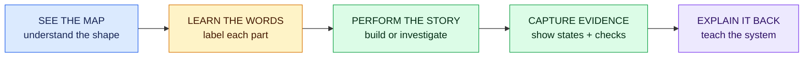

# Visual teaching standard

Pierre should be able to understand the shape of a lesson before reading every paragraph. Visuals are part of the instruction and evidence—not decoration.

## Every learning guide includes

1. **At-a-glance map:** a labeled Mermaid flow, sequence, state, or boundary diagram near the beginning.
2. **Stable meaning:** blue = context/evidence, amber = planning/decision, green = implementation/verified behavior, red = risk/security/failure, purple = review/delivery.
3. **Text equivalent:** nearby prose explains the same sequence or relationship for accessibility and search.
4. **Visible states:** UI work shows desktop/mobile and loading, empty, error, success, focus, and reduced-motion behavior where relevant.
5. **Evidence:** screenshots, recordings, diagrams, diffs, logs, or test reports are labeled with the story and acceptance criterion they prove.

## Choose the visual by the question

| Question | Visual |
| --- | --- |
| What happens next? | Flowchart or sequence diagram |
| Where does code/data run? | Boundary diagram |
| What changes after an event? | State diagram |
| Which option should we choose? | Decision tree or comparison matrix |
| Who owns what? | Role/ownership map |
| What does the interface look like? | Annotated wireframe or screenshot |
| How do records relate? | Entity-relationship diagram |

Keep diagrams focused. Split a crowded diagram instead of shrinking labels. Use words, shapes, arrows, and line styles so the lesson still works without color.

## Learner-created visual evidence

Codex may draft a diagram, but Pierre must verify every node and arrow against code, logs, or documentation. A milestone is not complete until he can redraw or narrate its critical flow without generated prose.
