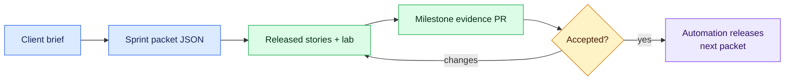

# Pierre Build Studio

This folder contains the fictional agency context used by the curriculum. The client and stakeholder names are invented. All data, credentials, incidents, and files must remain synthetic.

Client context becomes structured work, work becomes evidence, and accepted evidence unlocks the next assignment.

## Team

| Person | Role | What their tickets contain |
| --- | --- | --- |
| Maya Chen | Account/project manager | Goals, scope, approvals, timing, and stakeholder feedback |
| Jon Bell | Product designer | User flows, wireframes, responsive behavior, content hierarchy, and UI critique |
| Priya Raman | Senior engineer | Constraints, architecture questions, review, and maintainability concerns |
| Marcus Green | Security reviewer | Threats, authorization, secrets, privacy, and incident response |
| Elena Torres | QA analyst | Environments, reproduction steps, regression expectations, and release findings |

## Progressive delivery

Sprint packet JSON files are the source of truth for issue automation. The stories are intentionally visible because this is an open curriculum, but learners should work only from issues currently released in their fork.

A milestone packet can include kickoff, feature, spike, bug, chore, change request, review, and one interactive lab. The lab contract is loaded from `labs/catalog.json`, rendered into your released issue, and validated as part of the packet. Application code belongs in separate project repositories; browser lab code and curriculum evidence belong in milestone PRs on your fork.
