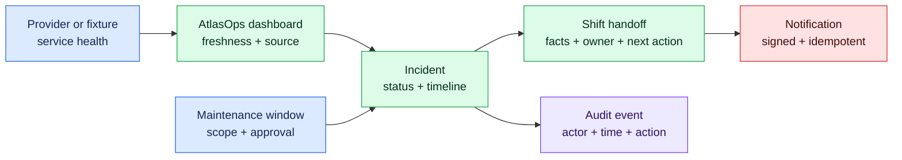

# AtlasOps — fictional operations portal brief

AtlasOps is an educational Next.js product for service health, maintenance windows, incidents, and shift handoffs. It lets Pierre turn existing operations judgment into a client-ready software portfolio without connecting to real infrastructure.

> [!IMPORTANT]
> Use synthetic organizations, sites, services, people, incidents, addresses, timestamps, and credentials. AtlasOps is not a CMDB, production monitoring system, network controller, or compliance-certified operations platform.

## Product journey

## Users and roles

| Role | Needed capability | Explicit boundary |
| --- | --- | --- |
| Operator | View permitted service health; create and update assigned incidents and handoffs | Cannot manage organization membership or another organization’s records |
| Lead | Manage sites, services, incidents, memberships, and maintenance approval | Must remain inside the active organization |
| Stakeholder | Read permitted status, maintenance, and incident updates | Cannot mutate operational records or view private operator notes |

## Minimum data model

- Organizations and organization memberships.
- Sites and services.
- Maintenance windows.
- Incidents and timestamped incident updates.
- Shift handoffs.
- Notification subscriptions.
- Audit events.

Every organization-owned row must have an explicit ownership path. Every mutation must identify the actor, action, resource, organization, timestamp, and safe outcome.

## Milestone releases

| Milestone | AtlasOps increment |
| --- | --- |
| 5 | Provider research, tested failure behavior, normalized contract, and ADR |
| 6 | Service-health dashboard with provider adapter, fixtures, freshness, and fallback |
| 7 | Versioned Supabase schema, synthetic seeds, CRUD, and organization-scoped RLS |
| 8 | Authentication, operator/lead/stakeholder roles, search, filters, and cross-tenant tests |
| 9 | Signed webhook or notification plus bounded AI shift-handoff summary |
| 10 | Release safety net, logs, backup/restore, rollback, game day, and support handoff |

## Non-goals

- No SNMP, SSH, device commands, real network discovery, or real monitoring ingestion.
- No employer systems, credentials, IP inventories, configurations, names, or incident data.
- No claim of production SLA, compliance certification, or replacement for established operations platforms.
- No automatic AI action that changes service health, authorization, maintenance approval, or incident ownership.
