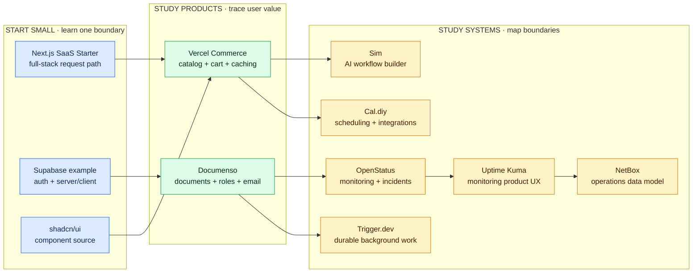

# Open-source project learning lab

The goal is not to copy a famous repository or understand every file. The goal is to see how experienced teams express product decisions, divide a system, protect data, test risky behavior, document operations, and collaborate in public.

Every link below is pinned to a reviewed commit so the lesson does not change unexpectedly. The live repository may have moved ahead. Check its current documentation, security notices, and license again before reusing code.

## Review register

| Project | Pinned commit | Last reviewed | Re-review by |
| --- | --- | --- | --- |
| Sim | `417ae20` | 2026-08-16 | 2026-11-16 |
| Next.js SaaS Starter | `6e33e58` | 2026-08-16 | 2026-11-16 |
| shadcn/ui | `d4fc45b` | 2026-08-16 | 2026-11-16 |
| Supabase Next.js example | `9be60ca` | 2026-08-16 | 2026-11-16 |
| Vercel Commerce | `3761e52` | 2026-08-16 | 2026-11-16 |
| Documenso | `688ef2f` | 2026-08-16 | 2026-11-16 |
| OpenStatus | `86f370c` | 2026-08-16 | 2026-11-16 |
| Uptime Kuma | `b980621` | 2026-08-16 | 2026-11-16 |
| NetBox | `93f16a5` | 2026-08-16 | 2026-11-16 |
| Trigger.dev | `c0b8459` | 2026-08-16 | 2026-11-16 |
| Cal.diy | `176037d` | 2026-08-16 | 2026-11-16 |

An expired entry remains readable but cannot be used for an architecture or code-reuse decision until its maintenance, documentation, security notices, and exact-commit license are reviewed again.

## Learning landscape



Blue projects are focused entry points. Green projects show complete product journeys. Amber projects are large systems to map selectively—not beginner starter kits.

## Curated projects

### 1. Sim — visual AI workflows and agent infrastructure

- **Pinned project:** [simstudioai/sim at `417ae20`](https://github.com/simstudioai/sim/tree/417ae2075d52bc777d3317d9540525cfe26bb49d)
- **License:** [Apache-2.0](https://github.com/simstudioai/sim/blob/417ae2075d52bc777d3317d9540525cfe26bb49d/LICENSE)
- **Best during:** milestones 2 and 9
- **Start at:** [`apps/sim`](https://github.com/simstudioai/sim/tree/417ae2075d52bc777d3317d9540525cfe26bb49d/apps/sim), [environment contract](https://github.com/simstudioai/sim/blob/417ae2075d52bc777d3317d9540525cfe26bb49d/apps/sim/lib/core/config/env.ts), and [contributor workflow](https://github.com/simstudioai/sim/blob/417ae2075d52bc777d3317d9540525cfe26bb49d/.github/CONTRIBUTING.md).

Sim is the example Pierre requested. Its current stack combines Next.js App Router, TypeScript, Tailwind/shadcn, PostgreSQL/Drizzle, Zod, React Flow, state/query tools, realtime communication, background jobs, and AI-provider integrations.

Study questions:

- How does a node-and-edge canvas translate visual intent into stored workflow data and execution?
- Which code belongs to the browser editor, Next.js server, realtime service, database package, background worker, and outside providers?
- How does the environment schema distinguish server credentials from public browser configuration?
- Which failures require retry, idempotency, timeout, cost limits, or human approval?
- Why would reproducing the whole architecture be a poor first project, and what one interaction could Pierre isolate as a learning spike?

### 2. Next.js SaaS Starter — smallest full-stack business skeleton

- **Pinned project:** [nextjs/saas-starter at `6e33e58`](https://github.com/nextjs/saas-starter/tree/6e33e58b1e553a41fe22e6b941a7229a002de361)
- **License:** [MIT](https://github.com/nextjs/saas-starter/blob/6e33e58b1e553a41fe22e6b941a7229a002de361/LICENSE)
- **Best during:** milestones 1, 3, and 8

This is a smaller place to inspect a recognizable Next.js application structure, authentication, database access, Stripe integration, shadcn/ui, environment configuration, and deployment assumptions.

Study questions:

- Trace signup or sign-in from route to server logic to database and response.
- Mark every Server Component, Client Component, Server Action, and external service touched by one journey.
- Which parts are product-specific, and which are reusable infrastructure?
- Which starter assumptions should be removed when a client does not need subscriptions?

### 3. shadcn/ui — component source, registries, and visual systems

- **Pinned project:** [shadcn-ui/ui at `d4fc45b`](https://github.com/shadcn-ui/ui/tree/d4fc45b1fbabfccb7a6a4333d8004cf19481caa9)
- **License:** [MIT](https://github.com/shadcn-ui/ui/blob/d4fc45b1fbabfccb7a6a4333d8004cf19481caa9/LICENSE.md)
- **Best during:** milestones 2 through 4
- **Start at:** the [v4 application](https://github.com/shadcn-ui/ui/tree/d4fc45b1fbabfccb7a6a4333d8004cf19481caa9/apps/v4) and the live [component documentation](https://ui.shadcn.com/docs/components).

Study questions:

- What is copied into the consumer project versus retained as a package dependency?
- Which behavior comes from an accessible primitive and which comes from local styling?
- How are variants, tokens, focus, disabled state, and responsive behavior expressed?
- How would Pierre adapt a component to ClearPath without retaining demo-only complexity?

### 4. Supabase Next.js user-management example — authentication boundaries

- **Pinned example:** [Supabase Next.js user management at `9be60ca`](https://github.com/supabase/supabase/tree/9be60cab63161100500bdae6dfd45501c5fd8b07/examples/user-management/nextjs-user-management)
- **License:** [Apache-2.0](https://github.com/supabase/supabase/blob/9be60cab63161100500bdae6dfd45501c5fd8b07/LICENSE)
- **Best during:** milestones 7 and 8
- **Pair with:** the current [official Next.js tutorial](https://supabase.com/docs/guides/getting-started/tutorials/with-nextjs).

Study questions:

- Why are there separate browser and server Supabase clients?
- Which public project values may reach the browser, and which credentials must never do so?
- How are cookies refreshed, and where is the authenticated user verified?
- Which authorization guarantee comes from RLS rather than a protected page?
- How would an owner-versus-other-user test prove the policy?

### 5. Vercel Commerce — data fetching, caching, and storefront states

- **Pinned project:** [vercel/commerce at `3761e52`](https://github.com/vercel/commerce/tree/3761e52e60df9c6a316e067dbfd7032e494d3634)
- **License:** [MIT](https://github.com/vercel/commerce/blob/3761e52e60df9c6a316e067dbfd7032e494d3634/license.md)
- **Best during:** milestones 3, 4, and 6

Study questions:

- Trace a product list and product detail from provider data to rendered UI.
- Where do caching and revalidation improve performance, and where could stale data hurt?
- How are image, loading, empty, unavailable, and cart states represented?
- How is provider-specific behavior isolated from the product interface?

### 6. Documenso — role-aware document workflows

- **Pinned project:** [documenso/documenso at `688ef2f`](https://github.com/documenso/documenso/tree/688ef2fdf303410dce3f519ad40f77ef9f37a7d2)
- **License:** [AGPL-3.0](https://github.com/documenso/documenso/blob/688ef2fdf303410dce3f519ad40f77ef9f37a7d2/LICENSE)
- **Best during:** milestones 8, 10, and 11

Documenso is useful for thinking about multi-step workflows, document metadata, recipients, permissions, email events, background work, and deployment. It is not proof that a new product is legally sufficient for signatures or forensic evidence.

Study questions:

- Draw the document lifecycle as states and identify who may cause each transition.
- Where do file storage, database metadata, email, and audit-like events cross trust boundaries?
- Which direct-object-access tests would you write before exposing a document route?
- Which compliance or legal claims must not be inferred from working code?

### 7. OpenStatus — observability as a product

- **Pinned project:** [openstatusHQ/openstatus at `86f370c`](https://github.com/openstatusHQ/openstatus/tree/86f370c9c20074c3c3fdec53a359874b8e670fd4)
- **License:** [AGPL-3.0](https://github.com/openstatusHQ/openstatus/blob/86f370c9c20074c3c3fdec53a359874b8e670fd4/LICENSE)
- **Best during:** milestones 5, 6, and 10
- **Start at:** the [Next.js dashboard](https://github.com/openstatusHQ/openstatus/tree/86f370c9c20074c3c3fdec53a359874b8e670fd4/apps/dashboard).

OpenStatus separates a Next.js dashboard, API server, checkers, databases/analytics, status pages, workflows, CLI, and integrations. It is an excellent boundary-mapping exercise.

Study questions:

- Trace one uptime check from schedule to execution, stored result, dashboard, alert, and public status page.
- Which system is the source of truth for current state versus historical analytics?
- How do API, CLI, infrastructure-as-code, and MCP interfaces expose the same capability differently?
- What must logs include to diagnose failure without leaking headers, tokens, or customer content?

### 8. Uptime Kuma — monitoring product and incident UX

- **Pinned project:** [louislam/uptime-kuma at `b980621`](https://github.com/louislam/uptime-kuma/tree/b980621689b2e3b978dcdd3a99a3ad8cf81c9b9b)
- **License:** [MIT](https://github.com/louislam/uptime-kuma/blob/b980621689b2e3b978dcdd3a99a3ad8cf81c9b9b/LICENSE)
- **Best during:** milestones 5, 6, and 10
- **Start at:** [`server`](https://github.com/louislam/uptime-kuma/tree/b980621689b2e3b978dcdd3a99a3ad8cf81c9b9b/server), [`src`](https://github.com/louislam/uptime-kuma/tree/b980621689b2e3b978dcdd3a99a3ad8cf81c9b9b/src), and [`test`](https://github.com/louislam/uptime-kuma/tree/b980621689b2e3b978dcdd3a99a3ad8cf81c9b9b/test).

Study questions:

- How does a monitor configuration become checks, state, history, notification, and status-page output?
- Which states communicate unknown, pending, degraded, down, paused, and recovered behavior?
- Which product patterns transfer to AtlasOps even though its implementation stack differs?
- Where could retries, notification fan-out, or stale state create operational confusion?
- Which patterns are safe to describe but unnecessary to copy into a small Next.js product?

### 9. NetBox — operations data modeling and ownership

- **Pinned project:** [netbox-community/netbox at `93f16a5`](https://github.com/netbox-community/netbox/tree/93f16a536d00227a404bb1d785fe355639bb5172)
- **License:** [Apache-2.0](https://github.com/netbox-community/netbox/blob/93f16a536d00227a404bb1d785fe355639bb5172/LICENSE.txt)
- **Best during:** milestones 7, 8, and the optional failure-domain lab
- **Start at:** [`netbox/dcim`](https://github.com/netbox-community/netbox/tree/93f16a536d00227a404bb1d785fe355639bb5172/netbox/dcim), [`netbox/tenancy`](https://github.com/netbox-community/netbox/tree/93f16a536d00227a404bb1d785fe355639bb5172/netbox/tenancy), and [`netbox/extras`](https://github.com/netbox-community/netbox/tree/93f16a536d00227a404bb1d785fe355639bb5172/netbox/extras).

Study questions:

- How are sites, devices, tenants, roles, status, and relationships modeled without placing every fact in one table?
- Which constraints protect data quality, and which rules live above the database model?
- How do permissions and tenancy differ from a simple owner column?
- Why should AtlasOps borrow modeling questions rather than NetBox’s full scope or architecture?
- Which real infrastructure details must never be copied into the public curriculum or synthetic AtlasOps data?

### 10. Trigger.dev — durable background work

- **Pinned project:** [triggerdotdev/trigger.dev at `c0b8459`](https://github.com/triggerdotdev/trigger.dev/tree/c0b84595a3522dbbd102af1a082d492dabfdba6f)
- **License:** [Apache-2.0](https://github.com/triggerdotdev/trigger.dev/blob/c0b84595a3522dbbd102af1a082d492dabfdba6f/LICENSE)
- **Best during:** milestones 9 and 10

Study questions:

- Why should long-running work leave a normal request/response path?
- What makes a retry safe, and where is idempotency recorded?
- How do queueing, concurrency, cancellation, logs, and run status affect the UI?
- How should a Next.js page communicate queued, running, failed, canceled, and completed states?

### 11. Cal.diy — scheduling and integration complexity

- **Pinned project:** [calcom/cal.diy at `176037d`](https://github.com/calcom/cal.diy/tree/176037d0afbe572f870a3c702985e7cd83fe6c0c)
- **License:** [MIT](https://github.com/calcom/cal.diy/blob/176037d0afbe572f870a3c702985e7cd83fe6c0c/LICENSE)
- **Best during:** milestones 8 through 11
- **Start at:** the [web application](https://github.com/calcom/cal.diy/tree/176037d0afbe572f870a3c702985e7cd83fe6c0c/apps/web).

Study questions:

- Model time zones, availability, conflicts, rescheduling, cancellation, and external calendar failure.
- Which operations need transactions, idempotency, or conflict checks?
- How does a large integration catalog affect secrets, setup UX, tests, and maintenance?
- Why should ClearPath's “just add booking” request receive a discovery spike and scope estimate?

## Study protocol: look → map → trace → challenge → adapt

```mermaid
flowchart LR
    LOOK["LOOK<br/>README · tree · docs<br/>license · recent activity"]
    MAP["MAP<br/>user · browser · server<br/>data · services · deploy"]
    TRACE["TRACE<br/>one user action<br/>through exact files"]
    CHALLENGE["CHALLENGE<br/>security · failure · cost<br/>accessibility · tradeoffs"]
    ADAPT["ADAPT<br/>one small pattern<br/>to the current story"]
    EXPLAIN["EXPLAIN<br/>diagram + evidence<br/>what not to copy"]

    LOOK --> MAP --> TRACE --> CHALLENGE --> ADAPT --> EXPLAIN

    classDef context fill:#dbeafe,stroke:#2563eb,color:#172554;
    classDef plan fill:#fef3c7,stroke:#d97706,color:#451a03;
    classDef build fill:#dcfce7,stroke:#16a34a,color:#052e16;
    classDef deliver fill:#ede9fe,stroke:#7c3aed,color:#2e1065;
    class LOOK,MAP,TRACE context;
    class CHALLENGE plan;
    class ADAPT build;
    class EXPLAIN deliver;
```



1. Spend ten minutes in the README, license, file tree, issues, and contribution guide without asking Codex for a summary.
2. Draw your own first architecture guess. Label what is evidence and what is assumption.
3. Give Codex the exact pinned commit. Ask it to correct the map with file-level evidence, not general framework knowledge.
4. Choose one user action and trace it through UI, server, data, external services, response, and failure states.
5. Inspect one security boundary, one test, one operational document, and one rejected or alternative design.
6. Complete [the open-source study template](../templates/open-source-study.md).
7. Adapt one small pattern to the current project only when the story needs it. Do not regenerate or transplant an entire feature.

## Codex prompt

```text
Act as my open-source code-reading partner. We are studying the exact pinned
commit and will not modify or run the project yet. First ask me for my own
architecture guess. Then inspect the README, license, package/workspace files,
project instructions, and relevant directories. Help me trace one user action
through browser, server, database, external services, response, and failure.
Cite exact files for every correction. Identify security, privacy, accessibility,
cost, deployment, and maintenance tradeoffs. Finish with one pattern worth
adapting to my current story and one pattern I should not copy.
```

## Safety and license boundary

- Public source is not automatically reusable source. Verify the license at the exact commit and follow its obligations.
- AGPL projects are valuable to study, but adapting or distributing their code can create obligations that require professional legal review.
- Never copy credentials, `.env` values, production data, branding, or proprietary assets.
- Never assume a popular repository is secure, accessible, simple, current, or appropriate for a client's budget.
- A large production monorepo is a map of accumulated constraints—not the correct starting architecture for a small client project.
