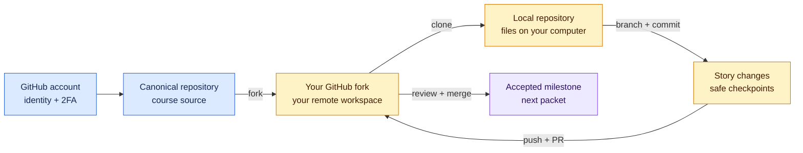

# Milestone 0 — GitHub and Agency Foundations

**Timebox:** 8 hours
**Outcome:** a secured GitHub identity, a first fork/clone/branch/PR, and a ranked inventory of real product ideas.

## Agency assignment

Maya has added you to Pierre Build Studio as a developer/product builder. No account or Git experience is assumed. Before client work, Priya needs proof that you understand what GitHub is for and can complete the basic collaboration loop without someone clicking through it for you.

## Visual map

Read left to right: establish identity, copy the course safely, work locally in checkpoints, then send evidence back through a pull request.

## Just-in-time field notes

### Why an agency uses GitHub

Software is a collection of files that changes over time. Git records that history so a team can see what changed, work without overwriting one another, review work before release, and recover from mistakes. GitHub stores Git repositories online and adds identity, issues, pull requests, review, automation, and permissions.

A **GitHub account** is your professional identity and the owner of your work. Use a durable personal email address, a professional username, a password manager, email verification, and two-factor authentication. Never share a login with a client or teammate.

### Repository, fork, clone, commit, branch, and pull request

A repository is the project and its history. A fork is your GitHub-owned copy of someone else's repository. A clone downloads a working copy to your computer. A commit is a named checkpoint. A branch is an independent line of work. A push uploads commits. A pull request is the conversation and evidence around merging a branch.

You do not need to memorize every Git command. You must know your current branch, inspect changes before committing, avoid committing secrets, and recover from common mistakes without deleting work.

Use the analogy: canonical repository = agency handbook; fork = your issued workbook on GitHub; clone = the copy on your desk; branch = one assignment in progress; commit = a labeled checkpoint; PR = the review packet.

## Work

Complete the released milestone 0 stories (SWAI-001 through SWAI-004):

1. Create a free personal GitHub account, verify the email address, enable 2FA, complete a professional profile, and explain why shared accounts are unsafe.
2. Complete GitHub's browser-based Hello World exercise: create a practice repository, README, branch, commit, issue, pull request, review, and merge.
3. Fork `saliftankoano/pierre-build-program` through the GitHub interface and explain why work belongs in the fork.
4. Install GitHub Desktop or Git, clone the fork, identify `origin` and `upstream`, make a small branch, commit, push, and PR.
5. Practice status, diff, conflict resolution, revert, and restoring one file using disposable lesson content.
6. Create an `IDEAS.md` inventory with at least ten ideas using the [idea scorecard](../templates/idea-scorecard.md). Score each 1–5 for user pain, access to users, smallest useful scope, data/security risk, API dependency, learning value, and client potential.
7. Select a quick-win idea, an API-centered idea, and a database-centered idea. Explain why the other ideas are deferred.

## Comprehension gate

- Explain account, repository, fork, clone, branch, commit, push, issue, pull request, merge, origin, and upstream without reading definitions.
- Draw the route a changed README takes from the local computer to a merged GitHub PR.
- Resolve a seeded text conflict and explain each conflict marker.
- Make one documentation change without asking AI to rewrite the file.
- Recover a deliberately reverted safe change using Git history.

## Evidence

Submit screenshots of account security with codes/secrets hidden, the Hello World and curriculum-fork links, the idea scorecard, practice issues/PRs, conflict-resolution evidence, and a short retrospective.

## Interactive lab — LAB-00

Complete [the first Next.js change window](../labs/core/LAB-00/README.md): edit the browser-opened handoff page in your fork, submit it through a branch and PR, resolve the supplied conflict, and revert a bad merged message without deleting history. Create the sanitized [learner profile](../learner-profile.yml) as part of the PR.

## Done when

No secrets appear in Git history, the three project candidates are selected, and you can create and explain the complete account-to-fork-to-local-to-PR workflow. Node, Codex, and deployment tooling are intentionally milestone 1.
