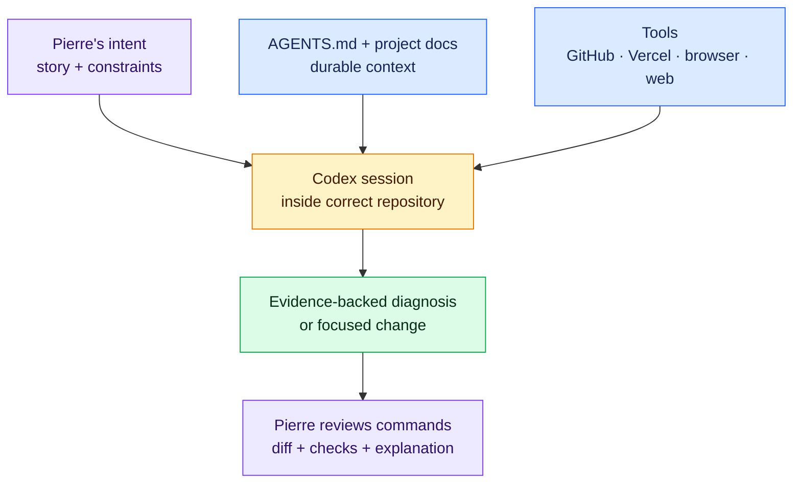

# Milestone 1 — Codex Developer Cockpit

**Timebox:** 8 hours
**Outcome:** Codex can safely inspect, build, test, deploy, and debug a Next.js repository using the local tools and durable project context you provide.

## Agency assignment

Priya wants one supported AI environment before client work. Codex is the core environment for this curriculum. You should know that Claude, Cursor, Copilot, v0, and other tools exist, but you will not switch among them while learning the basic workflow. The principles transfer later; the shortcuts and interfaces can wait.

## Visual map

The agent becomes more useful when it receives accurate context and inspectable evidence; Pierre remains the approval and verification boundary.

Use the [official Codex CLI quickstart](https://learn.chatgpt.com/docs/codex/cli) to install Codex, sign in, start it inside your curriculum clone, inspect session status, understand permissions, and ask it to explain the repository before making changes.

## Why the tool belt matters

Codex can reason from the files and commands available in its environment. A deployment URL alone tells it less than a linked Vercel project plus CLI access to deployment status, build logs, runtime logs, and environment names. The same principle later applies to GitHub, Supabase, browser testing, and API documentation.

Tools do not make Codex automatically correct. They provide better evidence. You still control permissions, protect secrets, inspect commands, and verify actions.

## Required setup

1. Install Node.js 24 LTS and confirm `node --version`, `npm --version`, and `npx --version`.
2. Install GitHub CLI, run `gh auth login`, and confirm `gh auth status` without publishing the token output.
3. Install Codex, sign in, start it from the curriculum repository, and use `/status`, `/permissions`, and `/review`.
4. Install Vercel CLI, authenticate, and practice `vercel help`, `vercel link`, `vercel list`, `vercel inspect DEPLOYMENT --logs`, and `vercel logs DEPLOYMENT` against a harmless practice deployment. Follow the [Vercel CLI documentation](https://vercel.com/docs/cli).
5. Confirm Codex can use browser or screenshot context in the chosen client and can perform current web/documentation search when the task requires current information.
6. Learn what MCP is without installing random servers. MCP can connect Codex to third-party tools and context; every server expands capability and trust surface. Add one only after reviewing its publisher, permissions, data exposure, and removal path. See the [official MCP guide](https://learn.chatgpt.com/docs/extend/mcp?surface=cli).

Supabase CLI is deliberately installed later as a project dependency so its version is pinned with the Next.js application.

## Durable context for Codex

Create a global Codex `AGENTS.md` from the [safe personal template](../templates/global-agents.example.md) and a repository-specific `AGENTS.md` from the [project template](../templates/project-agents.example.md). Official Codex documentation explains that project instructions are discovered from the project root toward the working directory, with nearer guidance taking precedence. See [Custom instructions with AGENTS.md](https://learn.chatgpt.com/docs/agent-configuration/agents-md).

Every project will also maintain:

- `docs/PRODUCT.md`: user, problem, scope, non-goals, success.
- `docs/ARCHITECTURE.md`: runtime boundaries, data flow, integrations.
- `docs/DECISIONS.md`: links to architecture decisions and rejected options.
- `docs/ENVIRONMENT.md`: tool versions and environment-variable names/owners, never values.
- `docs/DEBUGGING.md`: reproduction, expected/actual, errors, logs, attempts, and resolution.

## Learn with Codex instead of hiding confusion

When something is unclear, use this sequence:

1. “Explain this concept using the current Next.js story and point to the exact files involved.”
2. “Which part runs in the browser, Next.js server, build step, or external service?”
3. “Show me the primary API/framework documentation for the behavior.”
4. “Give me a prediction question before we run the code.”
5. “Let me explain it back; identify the specific gap in my explanation.”
6. “Make the smallest example or test that proves the concept.”

For any unfamiliar library or API, ask Codex to locate current primary docs, identify the installed version, compare the documentation to that version, and cite the exact section used. Generated examples without verified docs are not sufficient.

## Tool-awareness inventory

Create `docs/TOOLS.md` with each tool's job, authenticated account, commands Codex may use, sensitive data it can access, safe read-only diagnostic commands, mutating commands requiring approval, and uninstall/revoke steps. Include Git, GitHub/`gh`, Node/npm/npx, Codex, browser context, Vercel CLI, and future placeholders for Supabase CLI, Playwright, and API tooling.

## Comprehension gate

- Explain why starting Codex in the correct repository directory matters.
- Explain global versus project `AGENTS.md` and show Codex reporting the loaded instructions.
- Give Codex a screenshot and a Vercel build-log problem and compare the evidence each provides.
- Ask Codex to inspect a harmless failed practice deployment using Vercel CLI, identify the actual cause, and cite the relevant log line.
- Review a Codex-generated change with `git diff`, reject one unnecessary change, and keep the focused fix.
- Explain the difference between a CLI, API, SDK, MCP server, plugin, and documentation website.

Use the [PAUSE protocol](../playbooks/pause-protocol.md) whenever generated code is unclear.

## Interactive lab — LAB-01

Complete [the Codex and Vercel toolchain game day](../labs/core/LAB-01/README.md). Build the tool-access matrix, diagnose the missing preview configuration from evidence, make the smallest safe repair, and explain which tool could observe or mutate each system.

## Done when

The tool inventory is complete; Codex loads the intended instructions; GitHub and Vercel read-only diagnostics work; no secret is stored in the repository or prompt history; and you can use Codex to teach, inspect, verify, and debug rather than merely generate.
