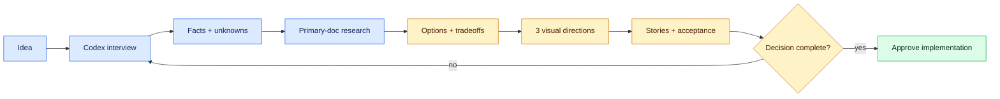

# Milestone 2 — Agent-Assisted Project Planning and UI Discovery

**Timebox:** 12 hours
**Mode:** planning only—do not implement the client application
**Outcome:** a decision-complete Next.js project plan and a specific visual/component direction that Codex can implement without guessing the product.

## Agency assignment

Maya has assigned the ClearPath project, but Priya will not approve implementation from a one-paragraph idea. Use Codex as a planning and research partner: it has broad technical knowledge and current web search, while you own the intent, constraints, taste, and final decisions.

The agent is not an oracle. It may know a tool you have never seen, but it can also recommend an obsolete, expensive, insecure, or mismatched option. Planning means combining your product knowledge with researched evidence.

## Visual map



This milestone ends at approval. No production application code is created until the important product, technical, and visual decisions are explicit.

## The partner-planning loop

1. Give Codex the raw idea, known users, desired outcome, constraints, examples, and what you do not know.
2. Ask it to interview you one material question at a time. Do not let it fill important gaps silently.
3. Ask it to separate facts, preferences, assumptions, unknowns, and decisions.
4. Ask it to research current options using primary documentation and show why each option fits or fails the constraints.
5. Compare build, library, API/service, and defer alternatives.
6. Ask for risks, likely failure modes, cost triggers, privacy/security implications, and the smallest spike that would reduce uncertainty.
7. Select the approach yourself and record the decision, rejected alternatives, and reversal trigger.
8. Convert the decision into epics, stories, acceptance criteria, dependencies, non-goals, test evidence, and milestone sequence.

Use this opening prompt:

```text
Act as my product and technical planning partner. Do not implement code.
First inspect the supplied brief and repository context. Interview me one
material question at a time about users, outcome, scope, data, integrations,
constraints, budget, visual direction, operations, and success. Separate facts,
preferences, assumptions, unknowns, and decisions. Then research current options
through primary documentation, compare them against my constraints, and help me
produce a decision-complete Next.js plan with stories, acceptance criteria,
risks, non-goals, validation, and rollback. Cite the documentation you rely on.
```

## Turn ideas into visual user stories

Use [Build user stories with Codex and visual Markdown](../resources/visual-story-writing.md) and the [agency user-story template](../templates/agency-user-story.md). Start from one ambiguous ClearPath request, let Codex interview you, and create one vertical story that a fresh coding task could implement without inventing product decisions.

Your story must include the persona, trigger, capability, outcome, facts, assumptions, unknowns, observable Given/When/Then examples, data/API boundaries, loading/empty/error/success behavior, security, privacy, accessibility, analytics, dependencies, non-goals, Definition of Done, and evidence. Add a Mermaid diagram only when it materially clarifies flow, state, ownership, hierarchy, or a system boundary. Follow every diagram with the same route in plain text.

Do not accept Codex’s first draft. Ask it to review the packet as the client, PM, designer, senior Next.js engineer, security reviewer, accessibility reviewer, and QA analyst. Answer material questions yourself, reject invented requirements, and inspect the Markdown diff after revision.

## Frontend language is part of the specification

“Make it clean and modern” gives Codex little usable direction. Learn to name the layout, hierarchy, components, states, interaction, motion, density, and responsive behavior you want.

Build a visual glossary with live examples of: header/navigation, hero, feature grid, bento grid, card, badge, form field, combobox, command palette, tabs, accordion, dialog/modal, drawer/sheet, popover, tooltip, toast, breadcrumb, pagination, table/data table, skeleton, empty state, error state, dashboard shell, sidebar, sticky region, breakpoint, container, grid, stack, spacing scale, radius, shadow, type scale, color token, variant, hover, focus-visible, disabled, loading, reduced motion, and responsive reflow.

For each term, save a link or screenshot, write what problem it solves, and describe one case where it would be the wrong choice.

## Explore component sources visually

Use the [UI Library Field Guide](../resources/ui-library-field-guide.md). Browse real examples before choosing:

- shadcn/ui for owned, customizable application components and registry blocks.
- Radix Primitives, Base UI, and React Aria for accessible unstyled behavior.
- Aceternity UI, Magic UI, 21st.dev, and Motion for visual ideas, sections, and motion patterns.

Do not install everything. Select one accessible primitive/component foundation for consistency, then at most two specialized copied components whose value is obvious. For every candidate inspect source, license, dependencies, bundle/client boundary, keyboard behavior, small-screen behavior, reduced motion, theme fit, and maintenance.

When semantic components or accessibility vocabulary remain unclear after exploring the live libraries, use the UI/accessibility entries in the [video learning path](../resources/video-learning-path.md), verify them against WAI and component-library documentation, and apply the idea to one wireframe critique. Do not implement production code in this milestone.

## Design-direction deliverables

Produce three clearly different directions, not three color swaps. Each direction must specify:

- Audience feeling and business purpose.
- Reference URLs/screenshots and what is being borrowed—not copied blindly.
- Page hierarchy and annotated low-fidelity wireframe.
- Typography, color, spacing, radius, borders/shadows, imagery, and motion.
- Component vocabulary and library/source shortlist.
- Mobile reflow, keyboard/focus, loading/empty/error behavior.
- Reasons the direction might fail the client or user.

Choose one direction through a scored critique against trust, clarity, conversion, distinctiveness, accessibility, performance, implementation risk, and client maintainability.

## Comprehension gate

- Explain the difference between product requirement, technical decision, visual preference, assumption, and unresolved question.
- Show one valuable tool/library Codex found that you did not know and verify it through primary docs.
- Reject one agent recommendation with evidence.
- Identify ten frontend patterns by name from live examples and explain their job.
- Compare a component package, an unstyled primitive, and copied registry source.
- Turn a vague client sentence into a vertical story and explain why it is not a frontend/backend/database task list.
- Render and narrate one Mermaid flow, then identify one diagram you deliberately omitted because prose was clearer.
- Present the final plan and design direction without asking Codex to speak for you.

## Interactive lab — LAB-02

Complete [the accessible UI system lab](../labs/core/LAB-02/README.md) using the [UI library field guide](../resources/ui-library-field-guide.md). The lab code is an isolated design experiment, not ClearPath production implementation.

## Done when

The planning packet contains an approved PRD, user journey, sitemap, architecture/tool decision matrix, risks, non-goals, story map, at least one implementation-ready visual agency story, acceptance strategy, three design directions, selected design system, component-source audit, and resolved or explicitly escalated questions. Markdown lint and Mermaid rendering pass. No production application code is written in this milestone.
