# Milestone 3 — First Next.js Vertical Slice

**Timebox:** 12 hours
**Client:** ClearPath Home Services
**Outcome:** one responsive page section deployed through a Vercel preview.

## Agency assignment

ClearPath is a fictional home-maintenance company expanding into a second city. The client needs a conversion-focused website, not a gallery of technology. Your first story is the hero-to-booking vertical slice: a visitor must understand the offer, trust the company, and start a quote request.

Read the ClearPath brief, discovery notes, design handoff, and the released stories before asking AI to code.

## Visual map

```mermaid
flowchart LR
    B["Client brief<br/>user + conversion goal"] --> P["Approved plan<br/>tokens + components"]
    P --> N["Next.js page<br/>semantic structure"]
    N --> R["Responsive UI<br/>mobile → desktop"]
    R --> V["Vercel preview<br/>visual review"]
    V --> Q["QA bug<br/>320px + 200% zoom"]
    Q --> E["PR evidence<br/>explain + modify"]

    classDef context fill:#dbeafe,stroke:#2563eb,color:#172554;
    classDef plan fill:#fef3c7,stroke:#d97706,color:#451a03;
    classDef build fill:#dcfce7,stroke:#16a34a,color:#052e16;
    classDef deliver fill:#ede9fe,stroke:#7c3aed,color:#2e1065;
    class B context;
    class P plan;
    class N,R,Q build;
    class V,E deliver;
```

The slice is vertical because it connects real client intent to implemented UI, responsive behavior, deployment, QA, and review—not because it contains many sections.

## Just-in-time field notes

- **HTML** gives content meaning: headings, navigation, buttons, forms, and sections.
- **CSS/Tailwind** controls layout and presentation. Mobile-first means the default works on a narrow screen, then larger breakpoints enhance it.
- **A component** is a reusable UI function. **Props** are inputs to that function.
- **Variables** name values. **Arrays** hold lists. **Objects** group named values. A loop such as `map` transforms a list into repeated UI.
- Browser code can react to clicks. Server code can safely use private credentials. The `use client` directive is a boundary, not decoration.

## Work

1. Create the project with `npm run project:new -- clearpath-home`. This generates a Next.js App Router application; do not substitute another framework in the core path.
2. Bring in the approved tokens, accessible component foundation, and at most two specialist components from milestone 2. Review copied source and dependencies with Codex before accepting them.
3. Turn the story into a small plan and a component inventory before generating code.
4. Ask Codex to identify which Next.js files run during development, build, server rendering, and browser interaction. When any term is unclear, use the milestone 1 learning sequence and verify it against the installed Next.js version's official docs.
5. Implement semantic navigation, hero, trust proof, primary/secondary actions, and a quote-entry interaction.
6. Test at 375px, 768px, and 1440px widths; keyboard through every interactive element.
7. Deploy a Vercel preview from the story branch, then use Vercel CLI to inspect its status and request a design review.

## Comprehension gate

- Explain the page component tree and how props/data reach repeated elements.
- Trace a CTA click from the rendered button to the resulting browser behavior.
- Change the trust-proof data model and UI without regenerating the section.
- Fix the supplied small-screen overflow bug and show before/after evidence.

## Done when

The preview meets every story criterion, uses no placeholder lorem ipsum, works without horizontal scrolling, has a logical heading structure, and the PR includes design evidence and your explanation.
