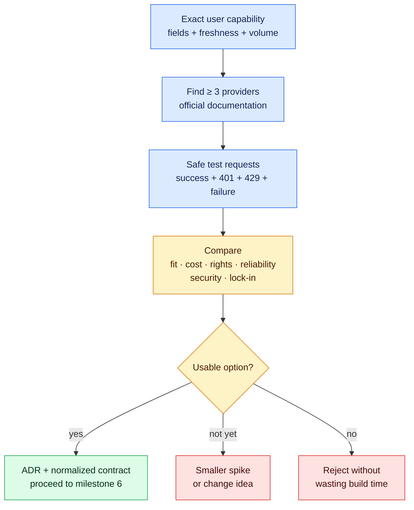

# Milestone 5 — API Research Spike

**Timebox:** 12 hours
**Outcome:** a defensible service-health API/tool decision for AtlasOps and a documented plan for consuming it through Next.js server code.

## Agency assignment

Maya has approved a timeboxed discovery sprint for AtlasOps, a fictional operations portal for service health, maintenance windows, incidents, and shift handoffs. No production UI will be built until you prove the necessary data or capability exists on acceptable terms.

## Visual map

The spike proves whether the needed capability exists on acceptable terms. It ends with a documented decision and contract, not a production interface.

## Just-in-time field notes

- An API is a contract for software-to-software communication. The URL and JSON are only part of it; authentication, limits, pricing, freshness, error behavior, and terms determine whether it is usable.
- HTTP methods express intent. Status codes describe outcomes. Headers carry metadata and credentials. JSON represents values through objects, arrays, strings, numbers, booleans, and null.
- An SDK can improve ergonomics but adds a dependency. Always understand the underlying API and escape hatch.
- A spike reduces uncertainty and ends with a decision, not production code.

## Research method

1. Write the user outcome and minimum data/capability required.
2. Find at least three candidates through official documentation, reputable directories, open-source projects, and targeted search.
3. Test the smallest request using `curl` or an API client.
4. Record authentication, sandbox, rate limits, pagination, price, data rights, freshness, uptime/support, SDK health, Vercel runtime compatibility, security, and lock-in.
5. Build a disposable proof of concept through a Next.js route handler or server-only adapter for the leading candidate.
6. Use Codex to find the current official API docs, then make it identify which claims in its proposed code come from those docs. Write an architecture-decision record: choose, reject, defer, and define a fallback.

## Comprehension gate

- Annotate a real request and response, explaining URL, method, headers, status, and JSON shape.
- Change a request parameter manually and predict the effect before running it.
- Diagnose seeded 401 and 429 responses without replacing the API.

Read the [AtlasOps client brief](../agency/clients/atlasops/brief.md) and the [network-to-web bridge notes](../resources/network-to-web-bridges.md) before comparing providers.

## Interactive lab — LAB-05

Complete [the unreliable-provider qualification lab](../labs/core/LAB-05/README.md). Classify synthetic 401, 429, timeout, and malformed-payload failures and defend the normalized AtlasOps contract.

## Done when

The decision uses primary documentation, includes real tested evidence with secrets removed, covers cost and failure modes, and defines the exact contract milestone 6 will consume.
