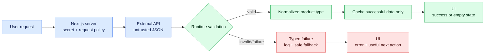

# Milestone 6 — Next.js API Data Product

**Timebox:** 16 hours
**Outcome:** the first deployed AtlasOps service-health dashboard powered by the provider selected in milestone 5.

## Agency assignment

The AtlasOps spike was accepted. Jon has supplied an operator service-health flow, Priya has constrained the first release to one valuable dashboard workflow, and QA will test slow, stale, empty, malformed, and rate-limited responses.

## Visual map

Success, empty success, malformed data, rate limits, and provider failure remain distinct. The seeded bug demonstrates why a failed response must never be normalized and cached as valid empty data.

## Just-in-time field notes

- `async` work finishes later; `await` pauses the current function without making the network instant.
- Types describe the shape you expect. Runtime validation checks the untrusted response you actually received.
- Server fetching protects credentials and can control caching. Client state powers interactions after rendering.
- Loading, empty, partial, stale, and error are product states, not afterthoughts.
- Cache duration should follow how quickly the underlying truth changes and what stale data would cost the user.

## Work

Create the AtlasOps project repository. Implement only the accepted workflow: server-side API adapter, runtime validation, normalized internal type, service-health dashboard, filters or pagination, refresh/freshness display, and useful failure states. Keep provider-specific shapes behind the adapter.

Add tests using recorded synthetic fixtures for success, empty result, malformed data, authorization failure, rate limiting, timeout, and provider outage. Do not call a paid API in unit tests.

## Comprehension gate

- Trace a user query through URL state, server request, API adapter, validation, normalization, and rendered result.
- Add a field to the normalized model and UI manually.
- Fix the supplied bug where a failed request is cached as successful data.

## Interactive lab — LAB-06

Complete [the AtlasOps stale-data game day](../labs/core/LAB-06/README.md). Keep provider shapes behind the adapter, expose freshness explicitly, bound retries, and recover a useful degraded state without displaying false green health.

## Done when

The Vercel deployment has separate configuration, no browser-visible secret, observable freshness, documented limits, accessible states, tests for the adapter contract, and a fallback message that tells the user what to do next.
