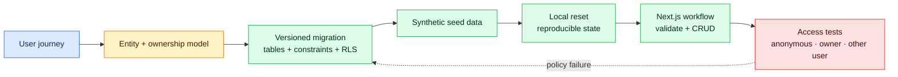

# Milestone 7 — Next.js + Supabase Product Foundation

**Timebox:** 16 hours
**Outcome:** AtlasOps has a reproducible, secure database foundation and its first persisted operational workflow.

## Agency assignment

Continue the AtlasOps repository from milestone 6. Model only the approved organizations, memberships, sites, services, maintenance windows, incidents, incident updates, shift handoffs, notification subscriptions, and audit events needed by the first persisted workflow.

## Visual map

The database is reproducible because schema, policies, and seed state live in versioned files. Security is proven by testing identities with different ownership relationships.

## Just-in-time field notes

- A table represents one kind of entity. A row is one record; a column is one fact with a type.
- A primary key identifies a row. A foreign key represents a relationship and prevents references to missing records.
- CRUD means create, read, update, and delete. Product behavior usually needs validation and permissions around every operation.
- A migration is a versioned database change. Seed data creates a safe, repeatable development state.
- Supabase's anon key is designed to be used by clients; Row Level Security is what restricts accessible rows. The service-role key bypasses RLS and must remain server-only.

If policy evaluation needs a visual walkthrough, use the Supabase RLS entry in the [video learning path](../resources/video-learning-path.md), then compare it with current Supabase documentation and prove AtlasOps tenant isolation using the milestone's own synthetic access tests.

## Work

Write the user journey, ER diagram, data dictionary, threat model, and minimum schema. Install Supabase CLI as a pinned dev dependency in the Next.js project, initialize it through `npx supabase`, and add its commands to `docs/TOOLS.md` so Codex can inspect local/linked state safely. Store schema, RLS policies, and seed data as migrations; prove a local reset reproduces the environment.

The browser lab never requires Docker. Your real AtlasOps project follows the official Supabase local-development workflow. If Docker cannot run on your computer, document the constraint in an ADR and use a separate hosted development project through the CLI; migrations, synthetic seeds, reset/reproduction instructions, and environment separation remain mandatory.

Implement one vertical workflow with runtime validation and clear UI states. Write tests for anonymous, owner, and different-user behavior before calling the milestone complete.

## Comprehension gate

- Explain each table and relationship without reading generated prose.
- Trace a create action from form to validation, database row, RLS decision, and refreshed UI.
- Add one constrained field through a migration and update the UI manually.
- Fix the seeded overly broad select policy.

## Interactive lab — LAB-07

Complete [the AtlasOps RLS policy-gap lab](../labs/core/LAB-07/README.md). Use synthetic users and records in the browser lab; prove the real AtlasOps policies separately through migrations and Supabase access tests.

## Done when

A new developer can clone, reset, seed, and run the project from documentation; database changes exist in Git; RLS is enabled with tested policies; and no service-role credential reaches the browser.
