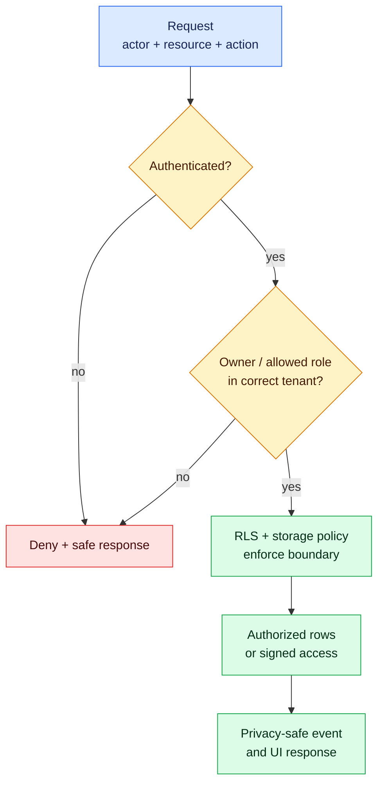

# Milestone 8 — Authenticated Next.js Product

**Timebox:** 18 hours
**Mentor gate:** required
**Outcome:** AtlasOps supports operator, lead, and stakeholder roles with organization ownership, protected resources, and tested authorization.

## Agency assignment

AtlasOps now needs real organization and role boundaries. The client also requested a design revision and an apparently urgent cross-site sharing feature midway through the sprint. You must protect the release while responding professionally.

## Visual map

Authentication identifies the actor; authorization evaluates the actor, action, resource, role, and ownership. Hiding a button never replaces the server, RLS, or storage boundary.

## Just-in-time field notes

- Authentication answers “who are you?” Authorization answers “may you do this?” A logged-in user is not automatically allowed to read every row.
- Enforce authorization in the database or server boundary, not by hiding buttons.
- Multi-tenant systems need an explicit ownership model. Every request must resolve the actor, resource, action, and tenant/owner relationship.
- Private storage uses policies and short-lived signed access. A hard-to-guess public URL is not access control.

## Work

Add sign-in, onboarding, ownership or organization membership, role-specific navigation, protected routes, private storage if the idea needs files, and useful account states. Implement search/filtering only after permissions are correct.

Respond to the change request with impact on schema, authorization, UX, tests, estimate, and launch. Accept, defer, split, or reject it explicitly.

Test an access matrix covering anonymous, user A, user B, privileged role, missing resource, direct URL, server action, database query, and storage access.

## Comprehension gate

- Trace identity from session to server/database policy.
- Explain why hiding a UI element is insufficient authorization.
- Add a role-limited action without regenerating the feature.
- Fix the seeded cross-tenant storage exposure.

## Mentor review

The mentor reviews the authorization model, access matrix, migration quality, product UX, change-control response, and your live code explanation.

## Interactive lab — LAB-08

Complete [the AtlasOps cross-tenant access lab](../labs/core/LAB-08/README.md). Reproduce the direct-object path as two synthetic organizations, repair both server and data boundaries, and add regression coverage.

## Done when

Cross-user tests fail closed, direct URLs do not bypass access, storage is private, privileged credentials stay server-side, the change decision is documented, and the mentor approves the architecture.
