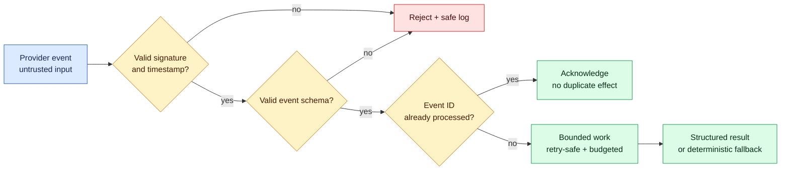

# Milestone 9 — Integrations and AI

**Timebox:** 16 hours
**Outcome:** one reliable third-party integration and one bounded AI capability with measurable value.

## Agency assignment

Stakeholders have proposed email, payments, automation, webhooks, and AI. Your job is not to add all of them. Select the smallest capabilities that improve the primary user workflow and document why the others are deferred.

## Visual map

Every external capability is untrusted and fallible. Signatures, validation, idempotency, budgets, evaluation, and fallbacks keep provider behavior from corrupting the core workflow.

## Just-in-time field notes

- Integrations introduce another system's identity, limits, failures, cost, and change schedule.
- A webhook is an incoming HTTP request. Verify its signature using the raw request as the provider documents, validate the event, make processing idempotent, and return promptly.
- Retry only operations that are safe to repeat or carry an idempotency key.
- AI output is untrusted external input. Prefer structured schemas, narrow context, explicit budgets, evaluations, and a deterministic fallback.
- Retrieval provides selected context; it does not grant truth. Prompt injection can arrive inside user content or retrieved documents.

## Work

Complete an integration decision record. Implement one email/webhook/payment/automation capability with server-only credentials, validation, failure logging, retry/idempotency behavior, and a local test strategy.

Implement one AI feature only if a non-AI baseline cannot meet the user need as well. Define an evaluation set with normal, edge, adversarial, and unavailable-provider cases. Log cost/latency without logging private prompt content.

## Comprehension gate

- Trace an integration event from provider to verified request, business action, database update, and user-visible result.
- Change one structured AI output field and its rendering manually.
- Fix the seeded duplicate-webhook processing bug.

## Done when

Provider failure does not corrupt core data, repeated events are safe, secrets remain server-only, AI has a budget and fallback, evaluation results are recorded, and the feature can be disabled without taking down the product.
