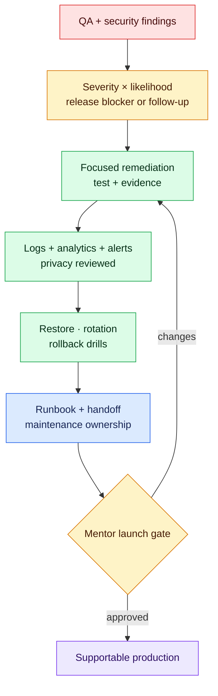

# Milestone 10 — Production Hardening

**Timebox:** 14 hours
**Mentor gate:** required
**Outcome:** AtlasOps is supportable after launch and has survived a synthetic multi-fault game day.

## Agency assignment

Elena and Marcus have completed the AtlasOps release review. Their tickets cover accessibility, stale status data, authorization regression, duplicate webhooks, environment drift, logging, dependency risk, backup/restore, a simulated credential leak, and rollback. The client also needs an operating handoff.

## Visual map

Hardening turns a working feature into an operable product: failures become detectable, risky boundaries gain regression tests, recovery is rehearsed, and ownership survives handoff.

## Just-in-time field notes

- Tests buy confidence at risky boundaries; they are not a score-collecting exercise. Unit-test transformations, integration-test boundaries, and browser-test critical user journeys.
- Logs should help reconstruct an event without recording passwords, credentials, full evidence, or unnecessary personal data.
- A deployment is not a backup. Prove how data and configuration are restored.
- Rotating a secret requires updating the provider and every consuming environment, invalidating the old value, redeploying, and verifying behavior.
- A rollback plan states what can be rolled back, what cannot, who decides, and how data changes are handled.

## Work

Triage the supplied findings by severity and user impact. Resolve release blockers; explicitly defer lower-risk work. Add CI, critical browser tests, accessibility checks, performance evidence, privacy-aware logs, monitoring/analytics, backup/restore instructions, dependency review, credential-rotation drill, rollback drill, admin runbook, user handoff, and maintenance proposal.

## Comprehension gate

- Use logs to reproduce and fix the seeded production-only failure.
- Explain which checks block deployment and why.
- Rotate the fictional training credential across local, preview, and production documentation.
- Revert a safe deployment and describe the database compatibility concern.

## Mentor review

The mentor runs the launch review, challenges one risk decision, observes the incident drill, and scores the handoff as if inheriting support.

## Interactive lab — LAB-10

Lead [the AtlasOps production game day](../labs/core/LAB-10/README.md). Prioritize the authorization blast radius, contain harm, recover synthetic service, perform rollback/restore, and submit a blameless postmortem.

## Done when

Critical journeys are tested, known limitations are explicit, no sensitive values appear in logs, recovery steps are executable, the production deployment is verified, and the mentor signs off on launch readiness.
