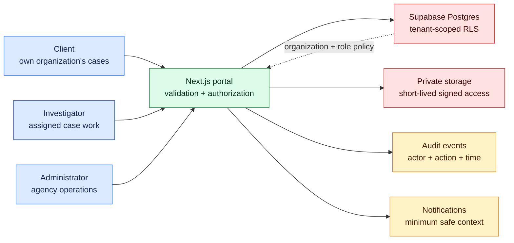

# Milestone 11 — Northstar Digital Forensics Capstone

**Timebox:** 32 hours
**Mentor gate:** final
**Outcome:** a complete simulated agency engagement delivered from discovery through support handoff.

> [!CAUTION]
> Use only the supplied synthetic data and safe sample files. This project is educational software—not court-grade chain-of-custody, evidence integrity certification, legal advice, or a compliance-certified forensic system.

## Client

Northstar Digital Forensics is a fictional three-investigator consultancy. Intake currently arrives through email and shared folders. Clients cannot see case status, investigators repeatedly request missing metadata, and the owner lacks a reliable activity history.

The initial release must support client, investigator, and administrator roles; case intake/status; evidence metadata; small safe sample uploads in private storage; signed access; timestamped audit events; notifications; role-specific dashboards; search/filtering; accessible responsive states; and proof that one client cannot access another client's cases.

## Visual system map

Every path passes through an explicit role and tenant decision. Storage and database access remain private; audit events and notifications use minimal safe context. This is an educational portal, not a legally sufficient evidence system.

## Engagement flow

1. Review the request for proposal and write discovery questions.
2. Convert answers into a PRD, user journeys, estimate, assumptions, risks, and out-of-scope list.
3. Propose schema, authorization matrix, threat model, UI direction, release plan, and acceptance strategy.
4. Receive design feedback and obtain an explicit approval record.
5. Deliver stories through small PRs and preview deployments.
6. Respond to a request for evidence sharing without weakening tenant boundaries.
7. Resolve the QA and security release report.
8. Demo the release, run the incident simulation, launch, and produce the client/admin handoff.

## Minimum domain model

- `profiles`: identity and agency role.
- `organizations` and `memberships`: tenant and role boundary.
- `cases`: client organization, status, summary, assigned investigator, and timestamps.
- `evidence_items`: case, submitter, safe metadata, private object path, size/type, and timestamps.
- `audit_events`: actor, action, resource type/id, timestamp, and safe context. Treat this as an educational activity log, not an immutable forensic ledger.

Use migrations, synthetic seeds, and RLS. File access must be private and time-limited. Validate type and size on the server. Do not claim that hashes, timestamps, or append-only rows alone establish legal chain of custody.

## Required deliverables

Discovery notes, PRD, estimate, architecture decision records, ER diagram/data dictionary, authorization matrix, threat model, UI critique, sprint PRs, automated tests, production URL, demo, launch checklist, client guide, admin runbook, deployment guide, incident plan, maintenance proposal, and final retrospective.

## Final comprehension defense

Without relying on generated prose, explain the architecture and trace client intake through validation, authorization, storage, audit event, notification, and dashboard. Make a requested field change through migration and UI. Diagnose a seeded direct-object-access failure. Rotate a fictional credential and explain rollback.

## Graduation rubric

Score at least 3 of 4 in product usefulness, UI/UX, code comprehension, maintainability, security, testing/reliability, deployment/operations, and client communication. Any unresolved critical authorization or credential failure blocks graduation.
