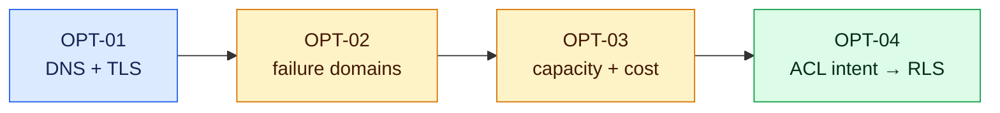

# Optional CCNP operations track — 12 hours

These four three-hour labs deepen Pierre’s infrastructure advantage. They are outside the required 178-hour core and do not block graduation.

| Lab | Build | Game day | Required evidence |
| --- | --- | --- | --- |
| OPT-01 · DNS and TLS | Draw the resolution, certificate, CDN, and Next.js request path | Diagnose synthetic NXDOMAIN, expired certificate, and wrong-environment hostname signals | Command/output annotations, layer decision table, recovery order |
| OPT-02 · Failure-domain mapper | Model browser, Vercel, Supabase, provider, email, and DNS dependencies | Determine user impact from three simultaneous dependency failures | Blast-radius map, assumptions, graceful-degradation proposal |
| OPT-03 · Capacity and cost | Add pagination, caching, request budgets, and cost estimates to a fixture | Handle a rate-limit storm without infinite retries or false freshness | Load results, request/cost model, bounded retry test |
| OPT-04 · ACL intent to RLS | Translate actor/action/resource/tenant requirements into policy tests | Find a policy that passes select but over-permits update | Policy matrix, owner/other/role tests, analogy-limit explanation |

Use the normal lab evidence template and prefix files `OPT-01` through `OPT-04`. These exercises use synthetic fixtures only.
