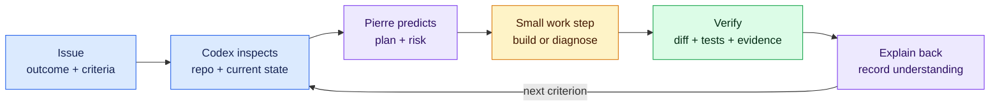

# Codex as your learning partner

Codex is the required AI environment for the core program. Use it for routine explanation, research, planning, implementation, debugging, and evidence preparation before asking a mentor.



**Text loop:** give Codex the issue → let it inspect → predict and agree on one step → perform the step → verify evidence → explain it back → repeat.

## Start every assignment with this prompt

```text
Read AGENTS.md, START_HERE.md, and the linked agency issue before acting.
I am working only on: ISSUE_URL.

First inspect the repository and restate:
- the user and business outcome;
- acceptance criteria and evidence required;
- relevant files, systems, and security boundaries;
- what is unclear or time-sensitive;
- the smallest safe next checkpoint.

Guide me one checkpoint at a time. Explain unfamiliar terms using the current
project, cite current official documentation, tell me what success looks like,
and ask me to predict the result before a meaningful command or code change.
Do not implement the whole issue at once. Never request or expose secrets or
private employer/client data. At each checkpoint, make me explain what happened.
```

## When a screen does not match the guide

```text
The guide says: PASTE_EXPECTED_LABEL.
I see: DESCRIBE_VISIBLE_LABELS.
Here is a cropped, redacted screenshot if useful.

Check current official documentation. Tell me whether the interface was renamed,
I am on the wrong page, or an account/repository setting is missing. Give me one
safe next click and the success signal. Do not guess and do not ask for private
account information.
```

## When a command or installation is unclear

```text
Before I run COMMAND, explain:
1. what program will execute;
2. which files, account, or external system it can read or change;
3. whether it is read-only, reversible, or destructive;
4. the expected output;
5. how to verify and undo it.

Check the official documentation and the version used by this repository.
```

## When something fails

```text
Expected:
Actual:
Reproduction steps:
Exact redacted error/log lines:
Relevant URL, file, or function:
What I already tried:

Inspect before editing. Identify the likely failing layer, state a hypothesis,
and name one alternative we should disprove. Give me the smallest diagnostic
step first. Do not regenerate the feature or change unrelated files.
```

## When selecting a tool, library, API, or architecture

```text
Help me decide, not merely generate code. Restate the product constraint, then
compare the simplest baseline and at least two realistic options. Use current
official documentation for version, price, limits, license, authentication,
security/privacy model, maintenance, deployment fit, and exit cost. Tell me when
not to use each option. Recommend one and identify what evidence could reverse
the decision. Draft the ADR only after I choose.
```

## End every work session with this prompt

```text
Before we stop, show me:
- current branch and working-tree status;
- files changed and why;
- checks run and exact results;
- acceptance criteria completed and still open;
- security/privacy concerns;
- the next smallest action;
- a short comprehension quiz covering the important code or workflow.

Do not commit, push, merge, deploy, change permissions, or contact anyone unless
the current issue authorizes it and I explicitly approve the target.
```

## Escalation rule

Codex should exhaust safe inspection, official documentation, deterministic checks, and reversible diagnostics. Escalate to the mentor only for a scheduled mentor gate, an unavailable external permission, a material product/client decision, or a blocker that still exists after a complete redacted evidence packet.
