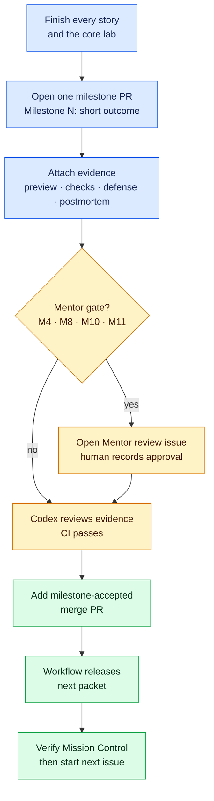
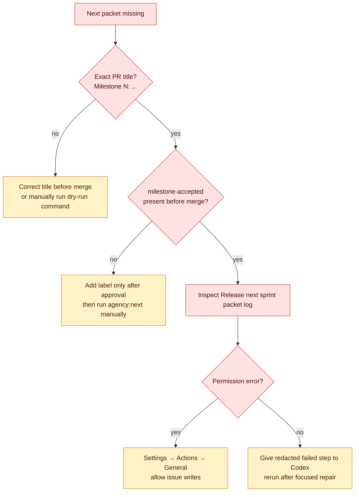

# Close a milestone and release the next packet

Use this procedure after every milestone. You should never need to guess whether the work is ready or ask what button comes next.



**Text route:** complete the packet → open the evidence PR → pass checks and the Codex defense → obtain human approval at the four mentor gates → apply the acceptance label → merge → verify the next packet.

## 1. Assemble one milestone PR

1. Confirm every issue for the current milestone is closed or linked to the PR with `Closes #NUMBER`.
2. Confirm `evidence/labs/LAB-XX.md` contains every required section.
3. Use the exact PR title format `Milestone N: short outcome`, replacing `N` with the number shown in Mission Control.
4. Complete every section of the PR template. A blank evidence cell is a failed gate, not a future reminder.
5. Add the preview or production URL and verify it in a private/incognito browser window.
6. Add screenshots or a recording for desktop, mobile, loading, empty, error, and success states that apply.
7. Run the repository checks named in the milestone and paste the safe results. Never paste tokens, environment values, cookies, or private user data.

## 2. Run the Codex defense

Start a fresh Codex task in the project repository and use this prompt:

```text
Read AGENTS.md, the current milestone guide, linked stories, the milestone PR,
and the lab evidence. Act as the senior engineer for a release defense.

Check every acceptance criterion against concrete evidence. Ask me to:
1. trace one user action across UI, server, database/provider, and response;
2. explain the important generated code in my own words;
3. make one controlled change without regenerating the feature;
4. diagnose the seeded incident from evidence and disprove one alternative;
5. explain blast radius, rollback, limitations, security, and accessibility.

Do not approve missing evidence. End with either READY or NOT READY and list
the exact unmet criteria. Do not add labels, merge, or claim human approval.
```

If Codex says `NOT READY`, repair only the listed gaps, rerun checks, update the evidence, and repeat the defense.

## 3. Determine the approval path

| Milestone | Required approval before acceptance |
| --- | --- |
| 0–3, 5–7, 9 | Complete evidence, green CI, and a Codex defense ending in `READY` |
| 4, 8, 10, 11 | Everything above plus a human mentor decision of `Approved` |

For Milestones 4, 8, 10, and 11:

1. Open **Issues → New issue → Mentor review**.
2. Replace the underscore in the title with the milestone number.
3. Link the milestone PR, deployment, and evidence index.
4. Your mentor copies [the mentor review rubric](../templates/mentor-review.md) into a comment, records all nine scores, and writes `Decision: Approved` or `Decision: Changes requested`.
5. If changes are requested, address them in the same PR and ask the mentor to record a new decision. Preserve the earlier review history.
6. Treat approval as valid only when every category is at least 3/4 and no critical authorization or secret-management failure remains.
7. After an approved decision is recorded, close the mentor-review issue. The release workflow checks for both the closed issue and the exact text `Decision: Approved`.

Codex can rehearse the review and find missing evidence. It cannot impersonate the mentor or provide the four required human approvals.

## 4. Accept and merge

Only when the applicable approval path passes:

1. Confirm every current milestone issue is already closed or linked in the PR with `Closes #NUMBER`. GitHub closes linked issues when the PR merges, and the release workflow then refuses to skip any issue that remains open or missing.
2. Add the `milestone-accepted` label to the milestone PR.
3. Recheck that the title uses the exact format `Milestone N: short outcome`.
4. Merge the PR without bypassing a failed required check.
5. Open **Actions → Release next sprint packet** and confirm the run is green.
6. Open Mission Control. Confirm the completed milestone says `accepted` and the next milestone says `released` or `active`.
7. Open the recommended next issue and begin a new Codex task with its URL.

Milestone 11 is final. Its release workflow intentionally reports that no later packet exists; proceed to the graduation checklist instead.

## Recovery when the next packet does not appear



If the PR was already merged without the exact trigger, ask Codex to preview this safe command before applying it:

```bash
npm run agency:next -- --repo YOUR_USERNAME/pierre-build-program --milestone N
```

After confirming the dry-run list is the expected next milestone, rerun with `--apply`. The release script is idempotent and skips existing story IDs.
