# PAUSE protocol for unfamiliar generated code

Do not hide confusion by asking Codex to regenerate a feature. Pause at the exact unknown and turn it into a small experiment.

```mermaid
flowchart LR
    P["POINT<br/>exact file + symbol"] --> A["ASK<br/>plain language in context"]
    A --> U["UNDERSTAND<br/>official docs + tiny example"]
    U --> S["SIMULATE<br/>predict a small change"]
    S --> E["EXPERIMENT<br/>run + compare"]
    E --> X["EXPLAIN<br/>teach back in own words"]

    classDef identify fill:#dbeafe,stroke:#2563eb,color:#172554;
    classDef research fill:#fef3c7,stroke:#d97706,color:#451a03;
    classDef action fill:#dcfce7,stroke:#16a34a,color:#052e16;
    classDef retain fill:#ede9fe,stroke:#7c3aed,color:#2e1065;
    class P identify;
    class A,U research;
    class S,E action;
    class X retain;
```

## Prompt sequence

1. **Point:** “In this story, I do not understand `FILE:SYMBOL`. Show exactly who calls it and what it returns.”
2. **Ask:** “Explain it using the current user action. Separate browser, build, server, database, and provider work.”
3. **Understand:** “Find the current official documentation for our installed version and give me the smallest relevant example.”
4. **Simulate:** “Ask me to predict the effect of one controlled change before we run it.”
5. **Experiment:** make the change, run the narrow check, and inspect the diff.
6. **Explain:** write the behavior, evidence, limit, and remaining question without copying Codex’s answer.

If the experiment could expose data, spend money, mutate production, change authorization, or install a new tool, stop and use the normal approval and security process first.
