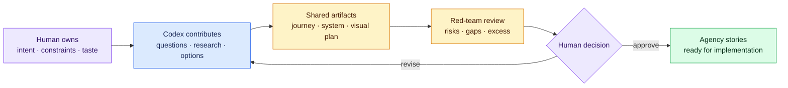

# Planning With Codex



The human supplies meaning and makes the decision. Codex widens the option space, researches evidence, structures the plan, and challenges missing or contradictory thinking.

## What the human owns

Intent, users, taste, business constraints, ethical boundaries, acceptable risk, budget, and final decisions. Codex can expose missing questions and research alternatives; it should not silently invent these inputs.

## What Codex contributes

Structured interviewing, repository inspection, current web research, option discovery, dependency/API documentation, architecture alternatives, risk review, story decomposition, acceptance criteria, test strategy, and contradiction detection.

## Planning conversation sequence

1. **Raw idea:** explain the problem in your own language without pretending it is already a specification.
2. **Interview:** tell Codex not to implement and to ask one material question at a time.
3. **Understanding check:** review facts, preferences, assumptions, unknowns, and contradictions.
4. **Research:** require primary sources, current versions/dates, costs/limits, security, maintenance, and rejected options.
5. **User flow:** define the trigger, steps, decisions, success, failure, and recovery.
6. **System shape:** browser, Next.js server, database, APIs, files, jobs, and deployment.
7. **Visual direction:** references, terminology, components, states, tokens, responsive behavior, and accessibility.
8. **Delivery:** epics, stories, acceptance criteria, dependencies, estimates, test evidence, rollout, and handoff.
9. **Red-team:** ask Codex how the plan could fail, what is unnecessary, and what has not been decided.
10. **Decision record:** human selects the approach and signs off before implementation.

Use [Build user stories with Codex and visual Markdown](../resources/visual-story-writing.md) when turning the approved journey into individual work. It includes the interview prompts, vertical-slicing method, Given/When/Then examples, diagram-selection guide, Markdown fundamentals, critique gate, and [agency story template](../templates/agency-user-story.md).

## Useful prompts

### Discover tools you do not know

```text
Given this user outcome and these constraints, research current tools, libraries,
APIs, and build-it-yourself approaches I may not know. Use primary documentation.
For each option show what problem it solves, current compatibility, cost/limits,
security/data boundary, maintenance health, lock-in, Vercel/Next.js fit, and why
we should reject it. Do not implement anything.
```

### Turn design taste into buildable language

```text
Interview me about the frontend. Help me name the layouts, components, hierarchy,
density, type, color, spacing, imagery, interaction, motion, responsive reflow,
and loading/empty/error states I am describing. Show live library examples when
a term is unfamiliar, but do not select a component until we audit its source,
license, dependencies, accessibility, mobile behavior, and design-system fit.
```

### Test the plan

```text
Review this plan as a senior Next.js engineer, product designer, security reviewer,
QA analyst, and client maintainer. Identify contradictions, missing decisions,
unnecessary complexity, risky assumptions, and acceptance criteria that cannot
be verified. Do not implement fixes; return questions and recommended decisions.
```

### Turn one outcome into a visual agency story

```text
Do not implement yet. Interview me about one user outcome, separate facts from
assumptions, and propose the smallest demonstrable vertical slice. Use
templates/agency-user-story.md. Write observable Given/When/Then acceptance
examples and add only the Mermaid diagram that clarifies an important flow,
state, ownership, or boundary. Include a plain-text route beneath the diagram.
Then critique the story for ambiguity, hidden scope, risk, and contradictions.
```
