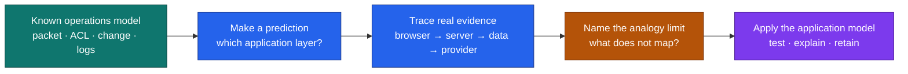

# Network-to-web concept bridges

Pierre is new to constructing applications, not new to technical systems. These bridges use familiar operational models to create an initial hypothesis. Each bridge also states where the analogy breaks so it does not become a false rule.

**Color key:** teal = existing strength · blue = investigation · amber = analogy limit · purple = retained application model.

| Existing mental model | Application concept | Where the analogy breaks | Mini experiment |
| --- | --- | --- | --- |
| Packet journey | Browser → Next.js server → database/API → response | HTTP application state is not packet state, and one user action can trigger multiple requests | Trace one form submission through DevTools and server logs |
| OSI layers | UI, server, persistence, provider, and deployment boundaries | Application layers do not map one-to-one to OSI and frameworks can cross boundaries | Label every file in one request as browser, build, server, data, or provider |
| ACL | Server authorization and Supabase RLS | RLS depends on identity, row ownership, joins, and operation type | Run the same row query as owner, other tenant, and anonymous actor |
| Change window | Issue → branch → PR → preview → deployment → rollback | A safe release must also validate user value, accessibility, and data compatibility | Merge and then revert a harmless Next.js content change |
| Failure domain | Service boundaries and dependency isolation | Serverless and managed platforms hide some physical boundaries | Disable a provider fixture and observe which product states remain useful |
| Device/system logs | Browser, application, Vercel, database, and provider evidence | Application logs can leak user content and credentials | Rewrite a useful failure log without payloads or secret values |
| Capacity planning | Caching, pagination, quotas, concurrency, and cost | Automatic scaling does not remove upstream quotas, correctness risks, or budget | Change a freshness threshold and measure requests and stale behavior |

## How to use a bridge

1. State the known operations concept without claiming it is equivalent.
2. Predict the application layer and expected evidence.
3. Run the smallest safe experiment.
4. Correct the model using the observed request, code, and logs.
5. Write one sentence beginning “This analogy stops being useful when…”

Codex may help inspect and explain evidence, but Pierre must make the first prediction and final teach-back.
