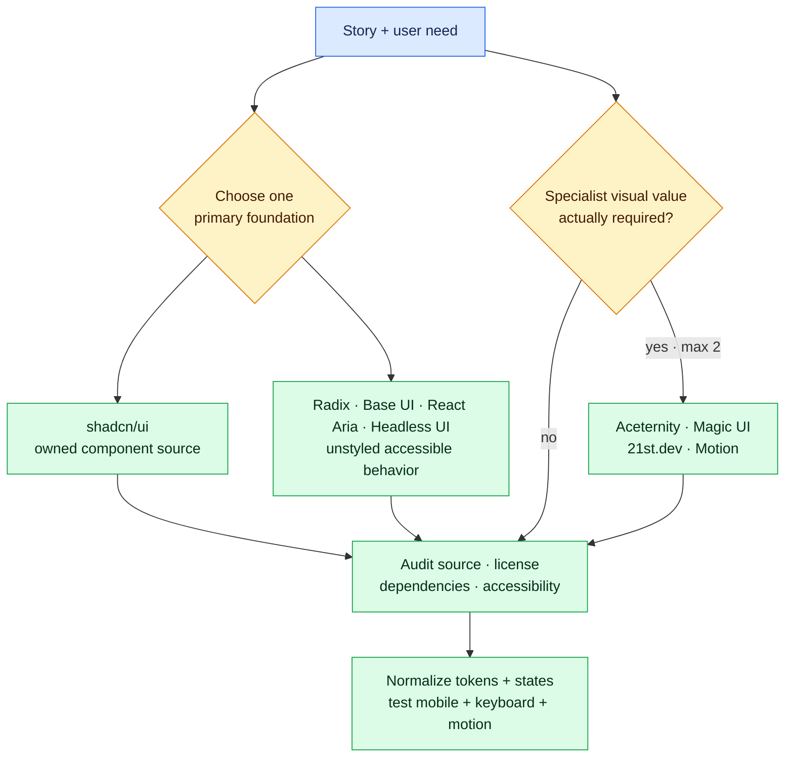

# UI Library Field Guide for Next.js

This is a curated starting map, not a shopping list. Check the source's current documentation, license, release activity, dependencies, and framework compatibility at the time you use it.

Start from the story, select one behavior foundation, add specialist visuals only when they create user value, then normalize and test everything as one system.

## Foundation choices

Choose one primary foundation per project. Mixing multiple primitive systems for the same interaction often duplicates dependencies and creates inconsistent focus, portal, styling, and state behavior.

### [shadcn/ui](https://ui.shadcn.com/docs/components)

Open component source and registry blocks designed to be added into your project and customized. Best for quickly establishing buttons, fields, dialogs, navigation, tables, and app shells while retaining ownership of the code. Inspect every installed registry item and its dependencies; community registries are third-party code.

Explore: Button, Field, Dialog, Sheet, Command, Combobox, Data Table, Sidebar, Skeleton, Empty, Toast, and Blocks.

### [Radix Primitives](https://www.radix-ui.com/primitives/docs/overview/introduction)

Low-level, unstyled React primitives centered on accessible interaction behavior such as focus management, keyboard navigation, roles, and composition. Useful when you want full visual control and a stable behavior layer.

Explore: Dialog, Dropdown Menu, Popover, Select, Tabs, Tooltip, Accordion, and Navigation Menu.

### [Base UI](https://base-ui.com/react/overview/about)

Unstyled React components for accessible design systems. Useful when you want a headless foundation and Tailwind/custom styling while retaining control over visual design.

Explore its [accessibility guidance](https://base-ui.com/react/overview/accessibility), Field, Menu, Dialog, Select, Combobox, and Toast.

### [React Aria](https://react-aria.adobe.com/)

Accessible, internationalized interaction components and hooks with support for complex widgets and varied input modes. Consider it for demanding tables, collections, date controls, drag/drop, selection, or internationalization needs.

Explore: Button, ComboBox, DatePicker, Table, GridList, Menu, Dialog, and form validation.

### [Headless UI](https://headlessui.com/)

Unstyled accessible components maintained for React and Tailwind workflows. Explore Dialog, Menu, Listbox, Combobox, Tabs, Disclosure, and Transition. Compare its behavior and styling ownership with Radix and React Aria before choosing it as a foundation.

## Visual and specialist sources

These can inspire or supply specialized components, but they do not replace a coherent product design system.

### [Aceternity UI](https://ui.aceternity.com/components)

React/Next.js marketing and interactive components, often using Tailwind and Motion. Strong for distinctive heroes, backgrounds, cards, and visual storytelling. Audit performance, pointer assumptions, mobile behavior, reduced motion, and dependency weight.

### [Magic UI](https://magicui.design/docs/components)

Copyable animated components and effects that follow shadcn-style installation. Useful for selective marketing emphasis. Do not allow decoration to overpower content, conversion, accessibility, or performance.

### [21st.dev](https://docs.21st.dev/)

A large searchable registry of components from many authors and styles. Useful for learning frontend terminology and finding visual references. Treat each author/component as a separate third-party source with its own quality, license, and dependency audit.

### [Motion for React](https://motion.dev/docs/react)

A React animation library for state, gesture, layout, and presence transitions. Use when CSS transitions cannot express the required behavior. Start with subtle purposeful motion, support reduced-motion preferences, and measure bundle/runtime impact.

### [Tremor](https://www.tremor.so/)

Dashboard and data-visualization components that can help Pierre learn terms such as KPI card, legend, tooltip, category scale, trend, and composition. Use it as a comparison source for AtlasOps; verify its current package model, license, accessibility, React compatibility, and chart semantics before adoption.

## Milestone 2 component safari

1. Compare a status card, data table, dialog, form, badge, toast, skeleton, empty state, and error state across at least three sources.
2. Record which code is copied, which remains a dependency, and who owns future accessibility fixes.
3. Rebuild the same small AtlasOps status panel in three visual directions.
4. Test keyboard, focus, touch, 320-pixel width, 200% zoom, reduced motion, and non-color status meaning.
5. Normalize the selected direction to one token set and record the selection in an ADR.

The exercise teaches vocabulary and judgment. It does not reward installing the most libraries.

## Component adoption checklist

For every external component, record:

| Question | Evidence |
| --- | --- |
| What user problem does it solve? | Link to story/acceptance criterion |
| Is it package code or copied source? | Install mechanism and ownership |
| What is the license? | Direct license link |
| Is it compatible with our Next.js/React/Tailwind versions? | Official docs or tested spike |
| Does it force a Client Component? | Server/client boundary and reason |
| Which dependencies and bundle cost arrive? | Package/source inspection |
| Does keyboard, focus, touch, screen reader, and reduced motion work? | Manual/automated evidence |
| Does it work at 320px and 200% zoom? | Screenshot/test evidence |
| Can it use our tokens and variants? | Small adaptation spike |
| Who maintains it after copy/install? | Project owner and update plan |

## Mixing sources without creating a mess

1. Normalize every adopted component to the project's color, typography, spacing, radius, shadow, icon, and motion tokens.
2. Wrap repeated variants behind the project's own component API.
3. Avoid installing a second primitive for an interaction already covered by the foundation.
4. Remove demo-only dependencies and decorative features.
5. Keep attribution and license notices where required.
6. Test the component as part of the real page, not only its attractive demo.
7. Ask Codex to review the copied source for unfamiliar behavior, then verify its claims against source and docs.
