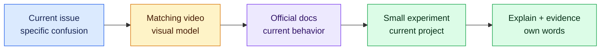

# Task-specific video learning path

Videos are optional visual reinforcement, not the source of truth. Watch the smallest relevant item while doing the matching project task, then verify commands, APIs, versions, security guidance, and pricing in current official documentation.

- **Last reviewed:** 2026-08-16
- **Review again by:** 2026-11-16



**Text route:** name the current confusion → watch only the matching video → verify it against official docs → reproduce one idea in the active project → explain the result without copying the presenter.

## Milestones 0–1 — Git, GitHub, and the web stack

| Watch when | Video | Why it helps | Verify afterward |
| --- | --- | --- | --- |
| Fork, branch, commit, merge, and history feel like unrelated words | [Git Explained in 100 Seconds — Fireship](https://www.youtube.com/watch?v=hwP7WQkmECE) | Gives a fast visual model before the Hello World exercise | [GitHub Hello World](https://docs.github.com/en/get-started/using-github/hello-world) |
| You need to see the full Git/GitHub loop performed slowly | [Git and GitHub for Beginners — freeCodeCamp](https://www.youtube.com/watch?v=RGOj5yH7evk) | Demonstrates repositories, branches, commits, remotes, and GitHub together | [GitHub Git guides](https://docs.github.com/en/get-started/using-git/about-git) |
| The Next.js App Router and browser/server boundary are new | [Introducing Next.js App Router — Vercel](https://www.youtube.com/watch?v=DrxiNfbr63s) | Shows the framework's routing and server-component mental model | [Current Next.js App Router docs](https://nextjs.org/docs/app) |
| You want a longer beginner build after the first small slice | [Next.js App Router with TypeScript — Programming with Mosh](https://www.youtube.com/watch?v=ZVnjOPwW4ZA) | Connects files, routes, components, data, caching, styling, and TypeScript | Compare every API with the installed Next.js version and current docs |

## Milestones 2–4 — UI, accessibility, and client forms

| Watch when | Video | Why it helps | Verify afterward |
| --- | --- | --- | --- |
| Markdown syntax makes the story packet hard to structure or preview | [Markdown Crash Course — Traversy Media](https://www.youtube.com/watch?v=HUBNt18RFbo) | Demonstrates headings, lists, links, tables, code, and GitHub-oriented Markdown | [GitHub writing and formatting](https://docs.github.com/en/get-started/writing-on-github) |
| You need to see text become an editable software flow diagram | [Flowcharts and class diagrams with Mermaid Chart](https://www.youtube.com/watch?v=SOHJHgLC2Pg) | Shows the connection between diagram intent and Mermaid source | [GitHub Mermaid diagrams](https://docs.github.com/en/get-started/writing-on-github/working-with-advanced-formatting/creating-diagrams) and [Mermaid syntax](https://mermaid.js.org/intro/syntax-reference.html) |
| A user-story headline is being mistaken for the complete requirement | [User stories with examples and a template — Atlassian](https://www.atlassian.com/agile/project-management/user-stories) | Reinforces user value, conversation, examples, and usable story detail | [Visual story-writing field guide](visual-story-writing.md) and the current agency story schema |
| A form's labels, controls, validation, and submission path are unclear | [Learn HTML Forms in 25 Minutes — Web Dev Simplified](https://www.youtube.com/watch?v=fNcJuPIZ2WE) | Visually connects semantic form elements, labels, validation, and submission | [MDN web forms](https://developer.mozilla.org/en-US/docs/Learn_web_development/Extensions/Forms) |
| You are reviewing keyboard, semantic, screen-reader, and visual behavior | [How to Handle Accessibility Like a Senior Dev — Web Dev Simplified](https://www.youtube.com/watch?v=Y7nhXvJ7yH8) | Provides a current practical accessibility review mindset | [WAI accessibility fundamentals](https://www.w3.org/WAI/fundamentals/accessibility-intro/) |

## Milestones 7–8 — Supabase authorization and authentication

| Watch when | Video | Why it helps | Verify afterward |
| --- | --- | --- | --- |
| SQL policies and organization isolation need a visual walkthrough | [Implement Authorization with Row Level Security — Supabase](https://www.youtube.com/watch?v=Ow_Uzedfohk) | Demonstrates the role of database policies in authorization | [Current Supabase RLS docs](https://supabase.com/docs/guides/database/postgres/row-level-security) |
| Next.js server/client auth boundaries and cookies are confusing | [The Right Way to Do Auth with the Next.js App Router — Supabase](https://www.youtube.com/watch?v=v6UvgfSIjQ0) | Shows authentication across server actions, routes, cookies, and protected pages | [Current Supabase SSR auth docs](https://supabase.com/docs/guides/auth/server-side/nextjs) |

## How Codex should use a video

Give Codex the video URL and say:

```text
This video is visual background, not authority. Identify the concepts relevant to
my current issue. Check the publication date and compare every technical claim we
intend to use with current official documentation and the versions installed in
this repository. Propose one small experiment. Do not copy an entire tutorial or
add dependencies just because the presenter used them.
```

If a video is unavailable, outdated, or uses incompatible versions, do not hunt randomly. Ask Codex to find a maintained replacement from the official vendor or a creator in [the dated watchlist](watchlist.json), verify it, and update this page with a review date through a normal PR.
