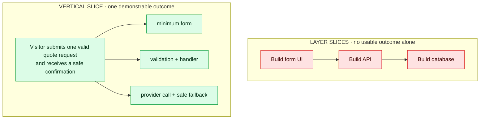
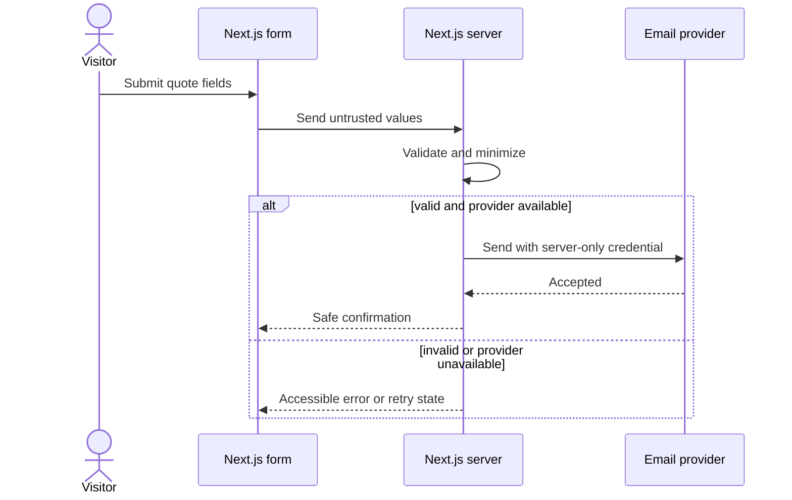

# Build user stories with Codex and visual Markdown

A user story is a conversation about a user outcome, captured well enough that you, Codex, QA, and a client can agree on what success means. The sentence “As a … I want … so that …” is only the headline. The buildable contract lives in the context, examples, boundaries, acceptance criteria, diagrams, and evidence.

```mermaid
flowchart LR
    R["RAW REQUEST<br/>client language"] --> I["INTERVIEW<br/>facts · unknowns · constraints"]
    I --> J["JOURNEY<br/>trigger · decisions · outcomes"]
    J --> S["STORY SLICE<br/>one valuable behavior"]
    S --> A["ACCEPTANCE<br/>observable examples"]
    A --> V["VISUAL MARKDOWN<br/>flow · sequence · states"]
    V --> C["CODEX CRITIQUE<br/>gaps · risk · excess"]
    C --> D{"DECISION<br/>ready to build?"}
    D -->|"no"| I
    D -->|"yes"| B["IMPLEMENT<br/>one accepted story"]

    classDef source fill:#dbeafe,stroke:#2563eb,color:#172554;
    classDef shape fill:#fef3c7,stroke:#d97706,color:#451a03;
    classDef proof fill:#ede9fe,stroke:#7c3aed,color:#2e1065;
    classDef ready fill:#dcfce7,stroke:#16a34a,color:#052e16;
    class R,I source;
    class J,S,A,V shape;
    class C,D proof;
    class B ready;
```



**Text route:** capture the request → interview for missing meaning → draw the journey → choose one valuable slice → define observable acceptance → visualize important behavior → red-team the packet → approve or revise.

## What Codex does—and what you own

| You own | Codex helps with | Never delegate silently |
| --- | --- | --- |
| User, problem, value, constraints, taste, budget, and final scope | Interview questions, decomposition, alternatives, formatting, diagrams, edge cases, and contradictions | Inventing client facts, deciding acceptable risk, accepting scope, or declaring its own output correct |

The same method transfers to other AI coding IDEs later. During the core program, use Codex only so you can learn the method without relearning several interfaces at once.

## The story-building conversation

Start with the raw request and this prompt:

```text
Act as my agency product partner. Do not write implementation code.

Turn the client request below into one buildable vertical user story. First
inspect the project brief and existing stories. Interview me one material
question at a time. Separate facts, preferences, assumptions, unknowns, and
decisions. Do not invent an answer.

After I approve your understanding:
- identify the persona, trigger, capability, and business outcome;
- propose the smallest end-to-end slice that delivers visible user value;
- identify dependencies, non-goals, data/API boundaries, security, privacy,
  accessibility, analytics, failure states, and evidence;
- write observable Given/When/Then acceptance examples;
- recommend only the diagrams that materially clarify the story;
- produce Markdown using templates/agency-user-story.md;
- end with contradictions and questions that still block implementation.

CLIENT_REQUEST:
PASTE_REQUEST_HERE
```

Do not ask for “all the stories” in one giant generation. Build and approve the journey, slice one story, critique it, and then repeat. Otherwise, plausible prose can hide invented requirements across an entire backlog.

## Slice by user value, not technical layer



**Text comparison:** “build the UI,” “build the API,” and “create the table” are implementation tasks. “A visitor submits a valid request and receives a safe confirmation” is a user-visible slice that may require all three layers.

A story is small enough when it can be demonstrated, tested, reviewed, and rolled back independently without losing its user outcome. If it still contains several unrelated outcomes, split it by workflow step, business rule, data variation, happy path versus recovery, or role—not automatically by frontend/backend/database.

## Write observable acceptance examples

Weak criterion: “The form works and looks professional.”

Stronger examples:

```gherkin
Given a visitor has entered every required quote field with valid values
When the visitor submits the form once
Then the server validates the untrusted values
And the visitor sees a keyboard-focusable confirmation without a page crash
And analytics records only the allowed event name, never the form contents

Given the email provider is unavailable
When a valid quote is submitted
Then no server credential appears in the browser response or logs
And the visitor receives an accessible retry message
And the request is not falsely presented as delivered
```

Acceptance criteria describe behavior that can be observed or proved. They do not dictate an internal implementation unless the implementation itself is a required constraint.

## Use the smallest useful diagram

| Question | Best starting visual | Avoid when |
| --- | --- | --- |
| What steps and decisions does the user encounter? | Flowchart | The story has only one obvious action |
| Who calls what, and in what order? | Sequence diagram | Order and runtime boundaries do not matter |
| Which states and transitions are legal? | State diagram | The value is a simple boolean with no lifecycle |
| Which records own or relate to other records? | ER diagram | No persisted data changes |
| Which system owns each responsibility? | Boundary/system flow | A short sentence is clearer |
| How do stories build toward a journey? | Story map/table | There is only one small story |

Example request path:



**Text route:** the browser sends untrusted values to the Next.js server; the server validates them and alone may call the provider; the interface receives either a safe confirmation or an actionable failure state.

## Markdown you need first

| Intent | Markdown |
| --- | --- |
| Structure the packet | `#` title, `##` section, `###` subsection |
| Record ordered work | `1.` numbered steps |
| Record independent items | `-` bullets |
| Track completion | `- [ ]` and `- [x]` |
| Compare exact fields | Pipe-delimited tables |
| Link evidence | Descriptive link text pointing to the evidence URL |
| Name code, commands, or files | Backticks |
| Preserve examples or payloads | Fenced code blocks with a language |
| Show an important GitHub note | `> [!NOTE]`, `> [!WARNING]`, or `> [!CAUTION]` |
| Render a diagram | A fenced `mermaid` block |

Preview the rendered file in GitHub or your editor. Run the repository Markdown and Mermaid checks. A source file that looks aligned in monospace may render differently.

Use [GitHub’s Markdown guide](https://docs.github.com/en/get-started/writing-on-github), [GitHub’s Mermaid guide](https://docs.github.com/en/get-started/writing-on-github/working-with-advanced-formatting/creating-diagrams), and [Mermaid flowchart syntax](https://mermaid.js.org/syntax/flowchart.html) as the current authorities.

If you need a visual introduction, watch [Markdown Crash Course — Traversy Media](https://www.youtube.com/watch?v=HUBNt18RFbo) and [Flowcharts and class diagrams with Mermaid Chart](https://www.youtube.com/watch?v=SOHJHgLC2Pg), then verify the syntax against the current GitHub and Mermaid documentation above.

## Visual quality rules

- Use diagrams to clarify sequence, state, ownership, branching, hierarchy, or repeated mappings—not to decorate every section.
- Give every diagram a one-sentence text route so meaning is available without rendering.
- Use labels in addition to color. Never encode “safe,” “failed,” or “approved” through color alone.
- Quote Mermaid labels containing punctuation and use short human-readable node text.
- Keep one diagram focused on one question. Split unreadable maps.
- Link diagrams to acceptance criteria and evidence; an attractive diagram is not proof.

## Story readiness critique

Ask Codex:

```text
Review this story as a client, product manager, designer, senior Next.js
engineer, security reviewer, accessibility reviewer, and QA analyst.

For every finding, quote the exact story section and classify it as:
- missing fact or decision;
- ambiguous outcome;
- unobservable acceptance criterion;
- hidden dependency or scope;
- security/privacy/accessibility/analytics gap;
- diagram contradiction;
- unnecessary implementation prescription.

Do not rewrite the story yet. Ask the smallest questions needed. After I answer,
revise only the affected sections and show the Markdown diff.
```

The story is ready when another Codex task can read only the approved project context and story, accurately restate the outcome and boundaries, propose a small implementation plan, and identify no material unanswered decision. You still inspect that plan before code begins.

## Practice exercise

Turn this deliberately weak request into one visual story packet:

> Add a professional booking form. Make it modern, send an email, track it, and let us add scheduling later.

Your packet must include at least five clarification questions, facts/assumptions/unknowns, one vertical slice, Given/When/Then happy and failure examples, explicit non-goals, one request-flow diagram with a text route, evidence requirements, and a Codex critique with your response.
