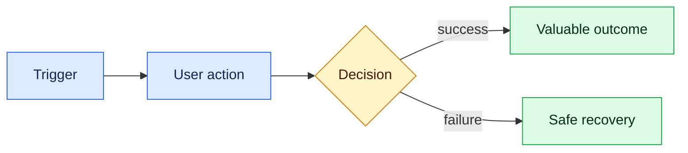

# STORY-ID — Outcome-focused title

| Field | Value |
| --- | --- |
| Type | Story / bug / spike / chore / change / review |
| Priority | P0 / P1 / P2 / P3 |
| Parent epic | |
| Persona | |
| Estimate/timebox | |
| Owner | |

## User story

As a **persona**, I want **one capability** so that **business or user outcome**.

## Context

### Facts

### Preferences

### Assumptions to validate

### Unknowns or decisions required

## User and request flow



**Text route:** replace this sentence with the same path in plain language.

## Acceptance criteria

```gherkin
Given
When
Then
```

```gherkin
Given a relevant failure or boundary condition
When
Then the product fails safely and gives the user an actionable state
```

## Data and API contract

- Inputs and validation:
- Outputs and safe errors:
- Persisted records and ownership:
- External service and failure behavior:

## Experience expectations

- Loading:
- Empty:
- Error:
- Success:
- Mobile/responsive:
- Keyboard/focus:
- Reduced motion or other relevant preferences:

## Cross-cutting expectations

- Security:
- Privacy:
- Accessibility:
- Analytics:

## Dependencies

## Explicit non-goals

## Definition of Done

- [ ] Acceptance examples pass.
- [ ] Relevant automated checks pass.
- [ ] Security, privacy, accessibility, and analytics expectations are evidenced.
- [ ] Preview or production behavior is demonstrated.
- [ ] Important code is traced, explained, and modified through the comprehension gate.

## Evidence required

- Deployment/preview URL:
- Screenshots or recording:
- Test/check output:
- Diagram and trace:
- Remaining limitations:

## Codex critique and your decision

- Material question raised:
- Your answer:
- Recommendation accepted/rejected and why:
- Story sections changed:
