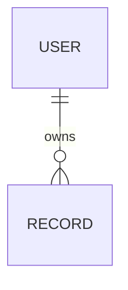

# Data model

## Ownership rules

| Actor | May create | May read | May update | May delete |
| --- | --- | --- | --- | --- |

## Entities

| Table/entity | Purpose | Key fields | Owner | Sensitive fields | Retention |
| --- | --- | --- | --- | --- | --- |

## Relationships and lifecycle

## Constraints, indexes, and validation

## Migration and seed plan

## RLS policy intent and adversarial tests

## Backup, deletion, and recovery
