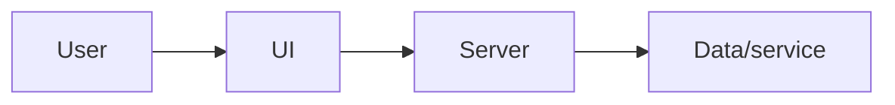
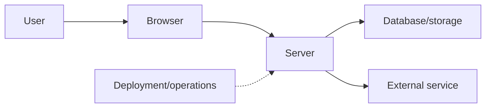

# Open-source project study

- Project and pinned commit:
- Repository URL:
- License and obligations to confirm:
- Date reviewed:
- Current milestone/story:

## My architecture guess before Codex

Label every unverified arrow as an assumption.

## Repository orientation

| Question | File/document evidence |
| --- | --- |
| What user problem does it solve? | |
| Where does the main application begin? | |
| How is the repository divided? | |
| Which instructions help contributors or agents? | |
| How is local configuration represented? | |
| Which checks protect changes? | |

## One user-action trace

| Step | Runtime/system | Exact file or API | Input/output | Failure state |
| ---: | --- | --- | --- | --- |

## Corrected boundary map

## Review

- Security/privacy boundary:
- Accessibility/UI state:
- Cost/operational boundary:
- Test or evidence pattern:
- Decision/tradeoff discovered:
- What I still cannot prove:

## Adapt—do not transplant

- One small pattern worth adapting to the current story:
- Why the story needs it:
- Smallest independent implementation or experiment:
- Primary documentation to verify:
- Pattern I will not copy and why:

## Explain back

Explain the corrected map without generated prose and show the exact evidence that changed your first guess.
